# Отлаживаем планировщик Postgres

В этом докладе рассмотрим то, как работает планировщик, но на уровне исходного
кода: функции и структуры данных. Кратко пробежимся по основным из них. Коснемся
такой темы как узлы (Node) - основ

### Подготовка

Для настройки репозитория для доклада необходимо запустить скрипт `init.sh`.

Этот скрипт:

1. Скачает PostgreSQL 16.4
2. Применит к нему патч для настройки окружения к докладу
3. Скопирует скрипты для разработки
4. Если установлен VS Code:
    1. Скопирует файлы конфигурации в `.vscode`
    2. Установит необходимые расширения

> Для скачивания исходников необходимы либо `wget`, либо `curl` (скачивание архива с исходным кодом), а также
> `tar` (разархивирование). Если они отсутствуют, то просьба скачать этот архив
> самостоятельно. Необходимы файлы версии 16.4. Можно скачать по этой ссылке -
> [https://ftp.postgresql.org/pub/source/v16.4/postgresql-16.4.tar.gz](https://ftp.postgresql.org/pub/source/v16.4/postgresql-16.4.tar.gz).
> Архив положить в эту директорию и запустить скрипт `init.sh` заново.

Для сборки и отладки с текущим скриптом необходимо установить:

- `libreadline`
- `bison`
- `flex`
- `make`
- `gcc`
- `gdb` (или другой отладчик)
- `CPAN` (для PERL)

Установить их можно:

```shell
# Debian based
sudo apt update
sudo apt install build-essential gdb bison flex libreadline-dev

# RPM based
sudo yum update
sudo yum install gcc gdb bison flex make readline-devel perl-CPAN
```

Ссылка на архив с 16.4 версией -
[https://ftp.postgresql.org/pub/source/v16.4/postgresql-16.4.tar.gz](https://ftp.postgresql.org/pub/source/v16.4/postgresql-16.4.tar.gz).

Настройку окружения можно произвести следующим образом (запуск **не** от root'а):

```shell
# Запускаем скрипт инициализации репозитория: скачивание файлов,
# применение патчей, установка расширений VS Code и т.д.
./init.sh

# Переходим в директорию с исходным кодом
cd postgresql

# Запускаем сборку (параллельно 8 воркеров, можно убрать)
./dev/build.sh -j 8

# Настраиваем схему БД
./dev/run.sh --init-db --run-db --psql --script=../schema_constrexcl.sql --stop-db

# Запускаем VS Code и открываем необходимые вкладки (если есть)
code . --goto src/backend/optimizer/util/constrexcl.c  \
        --goto src/backend/optimizer/util/clauses.c    \
        --goto src/backend/optimizer/plan/planmain.c
```

После этого можно запускать PSQL и выполнять скрипты из `queries_constrexcl.sql`.

Работа будет производиться в файлах (можно открыть предварительно):

- `src/backend/optimizer/util/constrexcl.c`
- `src/backend/optimizer/util/clauses.c`
- `src/backend/optimizer/plan/planmain.c`

> Если VS Code установлен ПОСЛЕ запуска скрипта настройки, то следует скопировать
> директорию `.vscode` в директорию с файлами БД (`postgresql`) вручную:
> `cp -r .vscode postgresql`. В ней находятся файлы конфигурации для
> VS Code.

Для полноценной отладки, необходимо установить дополнительно:

- `icu-i18n`
- `zstd`
- `zlib`
- `pkg-config`

И пакет PERL `IPC::Run`

## Высокоуровневая архитектура планировщика

### Алгоритм обработки запроса

В начале вспомним процесс обработки запроса. Алгоритм можно представить в виде 4
этапов:

1. Парсинг запроса
2. Переписывание запроса
3. Работа планировщика
4. Исполнение запроса


Сегодня поговорим именно о 3 этапе – работе планировщика.

Рассмотрим общий вид на то, как работает планировщик.
Его работу также можно поделить на несколько 4 этапа:

1. Предобработка дерева запроса
2. Оптимизация
3. Нахождение возможных путей выполнения
4. Выбор наиболее оптимального плана выполнения

Первые 2 этапа – это оптимизации. Разница заключается в том, что в 1 этапе мы
работаем только с деревом запроса и выполняем простые оптимизации, например,
constant folding (вычисляем выражения с константными значениями). А во 2 этапе
применяются уже более сложные оптимизации. Как правило они связаны со знаниями
о всем запросе (join'ы, ограничения, партиции и т.д.)

3 этап – мы находим все возможные пути выполнения запроса, используя знания
полученные после всех оптимизаций.

Последний 4 этап – строим план выполнения из самого дешевого пути.

### Организация в исходном коде

Говоря об исходном коде, это организовано следующим образом.

- `query_planner` – планировщик для создания путей доступа к самим таблицам,
    т.е. создает узлы Scan методов (SeqScan, IndexScan и т.д.)
- `grouping_planner` – обертка над `query_planner`, ответственная за добавление
    логики постобработки кортежей (сортировка, группировка). Грубо говоря,
    декорирует узлы чтения нужной логикой
- `subquery_planner` – входная точка для планирования 1 запроса: подготавливает
    запрос для `grouping_planner` и вызывает его
- `standard_planner` – входная точка самого планировщика

Схематично, это можно отобразить так.

На самом верху имеется `standard_planner`. Он подготавливает окружение и после
вызывает `subquery_planner` для самого высокоуровнего запроса.

`subquery_planner`: предобрабатывает *дерево запроса* и вызывает
`grouping_planner` для анализа всего запроса, а после создает план для самого
дешевого пути.

`grouping_planner`: отвечает за логику обработки прочитанных кортежей:
сортировка, группировка, оконные функции и т.д.

`query_planner`: инициализирует состояние планировщика и находит возможные
методы доступа к таблице.

`make_one_rel`: находит пути обхода таблиц для получения данных. Он находит
стратегии соединения таблиц и оптимальные пути их сканирования.

`standard_join_search`: функция для нахождения стратегии соединения таблиц,
порядок выполнения `JOIN`'ов. Здесь используется алгоритм динамического программирования,
но при достижении значения параметра `geqo_threshold` (по умолчанию 12) будет
использован GEQO (Genetic Query Optimizer).

```c
standard_planner()
{
    /* Инициализируем глобальное состояние планировщика */
    subquery_planner()
    {
        /* Предобработка дерева запроса */
        grouping_planner()
        {
            /* Настройка операций обработки данных */
            query_planner()
            {
                /* Инициализация планировщика */
                /* Оптимизации */
                /* Создание путей обхода таблиц */
                make_one_rel()
                {
                    /* Нахождение стратегии JOIN'ов */
                    standard_join_search()
                }
            }
            /* Добавление узлов обработки данных (сортировка, группировка и т.д.) */
        }
        /* Выбор самого дешевого пути */
    }
    /* Создание плана выполнения */
}
```

`subquery_planner` - запускается для каждого обнаруженного подзапроса, причем
верхнеуровневый запрос - тоже подзапрос, просто у него не родителя.


## Используемые структуры данных

Теперь поговорим о структурах данных.

### Узлы и деревья

Многие структуры данных в Postgres являются узлами - `Node`. Первое поле у
каждого узла - это `NodeTag`, дискриминатор типа. Это простой enum, который
составляется как префикс `T_` + название типа.

Все возможные узлы уже известны и их значения определяются в `src/include/nodes/node.h`,
либо, начиная с 16 версии автоматически генерируются в `src/include/nodes/nodetags.h`.

Реализации узлов находятся в заголовочных файлах в `src/include/nodes`. Эти файлы
оканчиваются на `*nodes.h`:

- `src/include/nodes/primnodes.h`
- `src/include/nodes/pathnodes.h`
- `src/include/nodes/plannodes.h`
- `src/include/nodes/execnodes.h`
- `src/include/nodes/memnodes.h`
- `src/include/nodes/miscnodes.h`
- `src/include/nodes/replnodes.h`
- `src/include/nodes/parsenodes.h`
- `src/include/nodes/supportnodes.h`

### Какие бывают узлы

На этой схеме представлено дерево этих узлов. Все не уместились - их около 500, поэтому
рассмотрим основные. (С версии 8.0 до 17 уникальных - 555).


`List` - это список (как связный список). Хранить он может в себе `Node *`, `int`,
`Oid` или `TransactionId`, но только одного типа. Достигается это тем, что
у списка есть отдельный тэг для каждого типа:

| Тип             | Тэг         |
| --------------- | ----------- |
| `Node *`        | `T_List`    |
| `int`           | `T_IntList` |
| `Oid`           | `T_OidList` |
| `TransactionId` | `T_XidList` |

Но при этом, название типа одно и то же - `List`.

`Bitmapset` - это множество чисел.

`Expr` - это базовая структура для узлов, которые могут быть выполнены (выражения).
Они встречаются, например, в списке атрибутов `SELECT` или с условиях `WHERE`. Примеры:

| Структура  | Описание             | Результат выполнения             |
| ---------- | -------------------- | -------------------------------- |
| `Var`      | Атрибут таблицы      | Значение атрибута из кортежа     |
| `Const`    | Константа            | Значение константы               |
| `OpExpr`   | Оператор             | Вызов оператора с аргументами    |
| `FuncExpr` | Функция              | Вызор функции с аргументами      |
| `BoolExpr` | Логическое выражение | Выполнение логического выражения |
| `SubPlan`  | Подзапрос            | Результат запроса                |

> `Node` и `Expr` - это псевдоузлы, в том понимании, что у них нет своего тэга.
> Они служат только маркерами: `Node` - это узел, `Expr` - это вычисляемый узел.

Еще одна группа - узлы плана планировщика. Это узлы, которые использует планировщик
для нахождения возможных путей выполнения запроса. Они содержат информацию, которая
нужна только для выбора пути, но не нужна во время выполнения. Например, селективность.

### Представление запроса в дереве запроса

Вначале, рассмотрим как запрос представляется в дереве запроса.

На схеме ниже можно увидеть соотношение частей запроса и структур *дерева запроса*, ответственных за них.


`Query` - это структура, которая представляет все дерево 1 запроса.
Если нам встречается подзапрос, то `Query` создается и для него.

Далее, акцентируем внимание на представлении таблиц. Здесь стоит рассказать о
важной абстракции - `Range Table`.

Грубо говоря, `Range Table` - это все, что находится в выражении `FROM`,
список используемых источников данных для запроса. Каждый такой элемент
называется Range Table Entry. Ими могут быть:

- Таблица
- Функция
- Другой подзапрос
- `JOIN`'ы
- CTE
- `VALUES`

`RangeTblEntry` - это структура, представляющая Range Table Entry. Типы таких
RTE определяются перечислением `RTEKind` (значения начинаются с `RTE_`).

Для данного запроса `Range Table` будет следующим:

- `tbl1` - `RTE_RELATION`
- `tbl2` - `RTE_RELATION`
- `tbl1 JOIN tbl2` - `RTE_JOIN`
- `generate_series` - `RTE_FUNCTION`
- `tbl1 JOIN tbl2 LEFT OUTER JOIN generate_series` - `RTE_JOIN`
- `(SELECT MAX(id) ... )` - `RTE_SUBQUERY`

Также стоит отметить, что для каждого запроса свой `Range Table`, поэтому
`tbl3` - это RTE уже для подзапроса и в списке выше его нет.

Цветом выделены различные `RTEKind`. Зачем это сделано - далее.

### Представление запроса в планировщике

Теперь, представление этого же запроса, но в контекста планировщика.


Можете заметить, что имеется корреляция между деревом запроса и планировщиком.

`PlannerInfo` - это информация, касательно 1 запроса. Она создается и для каждого
подзапроса. (почти как `Query`).

`RelOptInfo` - информация планировщика об отношении. Отношением (relation) могут быть
    таблицы, SRF (set returning function), подзапросы, CTE, JOIN'ы и т.д.
    Основная работа планировщика ведется с ними. Также есть и брат - `IndexOptInfo` -
    информация об индексе.

У каждого `RelOptInfo` есть свое перечисление `RelOptKind`. Он говорит о том, что
за тип отношения перед нами.

Здесь нам и пригодится выделение цветом. `RELOPT_BASEREL` - зеленый, так же как
и `RTE_RELATION`, `RTE_FUNCTION` и `RTE_SUBQUERY`. Заметьте, что последние
(таблица, функция, подзапрос ) имеют как минимум 2 общие черты: название (чтобы
к ним можно было обращаться) и список возвращаемых атрибутов. Такие отношения
называют базовыми (base rel, base relation в оригинале). Планировщик в основном
работает не с таблицами/функциями/подзапросами, а с базовыми отношениями, то есть
информация о происхождении отношения ему не интересна.

Для `RTE_JOIN` создается уже `RELOPT_JOINREL`. Можно заметить отличие с деревом
запроса. В дереве запроса у нас было несколько `RTE_JOIN`, а здесь 1.
Причина в том, что `RelOptInfo` для `JOIN`'ов создается единственный и в нем
хранятся все отношения, которые необходимо соединить. Благодаря такому подходу
проще найти наиболее оптимальный порядок соединений, так как не приходится постоянно
проходить все дерево `JOIN`.

> Кроме `RELOPT_BASEREL` и `RELOPT_JOINREL` имеются и другие значения `RelOptKind`.
> Они нужны, например, для поддержки наследования таблиц или `UNION ALL`.
> Сейчас на них не будем останавливаться.

### Вспомогательные структуры

В своей работе планировщик использует множество вспомогательных структур данных.
Одни из таких `RestrictInfo` и `EquivalenceClass`:


`RestrictInfo` - это какое-либо ограничение, наложенное на запрос. Например,
условие из `WHERE` или `JOIN`. В запросе имеется 3 ограничения:

- `t1.id = t2.id` - условие `JOIN`
- `t1.value = t2.value` - первое условие `AND` в `WHERE`
- `1.value = 0` - второе условие `AND` в `WHERE`

> Всякие ограничения называются в коде `qualification` (сокращенно `qual`)

`EquivalenceClass` (класс эквивалентности) - грубо говоря, это множество из
равных друг другу элементов. В запросе имеется 2 класса эквивалентности:

- `t1.id` и `t2.id`
- `t1.value`, `t2.value` и `0`

Можно заметить, что `EquivalenceClass` создается с помощью `RestrictInfo`. Обе этих
структуры важны, так как помогают планировщику находить более оптимальные пути
сканирования:

- `RestrictInfo` может сразу сказать какой индекс нужно использовать. Например,
  у нас есть индекс на поле `t1.value`, тогда мы сможем его использовать
  так как у нас имеется ограничение `t1.value = 0`.

- `EquivalenceClass` помогает находить зависимости между данными. Представим, что
  в нашей схеме индекс создан не на `t1.value`, а на `t2.value` - тогда нельзя
  использовать индекс для `t1.value = 0`, но мы знаем, что `t1.value = 0`, а
  `t1.value = t2.value`, поэтому заключаем, что `t2.value = 0` и можем использовать
  индекс.

## Реализуем Constraint Exclusion

Теперь мы знаем достаточно, чтобы работать с планировщиком.

Предлагаю реализовать Constraint Exclusion - это оптимизация, которая учитывает наложенные ограничения на запрос.

### Постановка задачи

Для конкретики - мы хотим учитывать допустимый диапазон возможных значений.
Например, если в `WHERE` имеется `AND` со сравнениями атрибутов, то этот атрибут
не может быть одновременно больше и не больше определенной константы. Вот этим
и займемся.

Например, такой запрос не может вернуть нам ничего:

```sql
SELECT * FROM tbl1
WHERE 
    value > 0 
  AND
    value <= 0;
```

### Проектируем решение

Первым шагом поймем что мы будем искать. Нам нужно найти следующий шаблон узлов
в коде.


Мы ищем:

- `BoolExpr` - булево выражение с условием `AND`, у которого
- Оба выражения - `OpExpr`, вызовы оператора, имеющие
- разные только операторы (противоположные), где у каждого вызова оператора
- слева - столбец таблицы, `Var`, а
- справа - константа, `Const`, причем
- соответствующие операнды равны между собой

Если мы обнаружили такой паттерн, то можем сказать, что этот запрос можно убрать из рассмотрения - он ничего не вернет.

В примере, это численное сравнение - никакое число не может быть одновременно
и больше и не больше 0.

Для простоты будем искать только их - без `OR`, `NOT`, обнаружения перестановок
операндов и прочего. Только `AND`, столбцы и константы со строгим порядком.

### Реализация

Для начала спроектируем вспомогательную функцию - она будет получать `Var` и
`Const` из переданного `OpExpr`.

Первым делом определим, что по обе стороны оператора - столбец таблицы и константа.
Оператор - это тоже функция с аргументами. Аргументы хранятся в поле `args`.
Так как мы ищем бинарные операторы, то длина `args` должна равняться 2. Для получения длины списка существует функция `list_length`.

```c++
if (list_length(expr->args) != 2)
{
    return false;
}
```

Аргументы следуют в порядке вызова. В нашем случае первый аргумент должен быть
столбцом, а второй - константой. Столбец таблицы выражается узлом `Var`, а
константа - `Const`.

Для проверки тэга узла используется макрос `IsA(nodeptr, type)`. Для получения
первого и последнего элемента списка используется макрос `linitial` и `llast`
соответственно:

```c++
/* Первый аргумент - столбец таблицы */
if (!IsA(linitial(args), Var))
{
    return false;
}

/* Второй аргумент - константа */
if (!IsA(llast(args), Const))
{
    return false;
}

*out_var = (Var *) linitial(args);
*out_const = (Const *) llast(args);
```

В итоге, вспомогательная функция для получения операндов выглядит следующим образом:

```c++
static bool
extract_operands(OpExpr *expr, Var **out_var, Const **out_const)
{
    /* Должно быть ровно 2 аргумента */
    if (list_length(expr->args) != 2)
    {
        return false;
    }

    /* Первый аргумент - столбец таблицы */
    if (!IsA(linitial(expr->args), Var))
    {
        return false;
    }

    /* Второй аргумент - константа */
    if (!IsA(llast(expr->args), Const))
    {
        return false;
    }

    *out_var = (Var *) linitial(expr->args);
    *out_const = (Const *) llast(expr->args);
    return true;
}
```

Перейдем к реализации основной логики. Она будет находится в функции `is_mutually_exclusive`.
Она работает следующим образом: на вход принимает 2 `OpExpr` (вызовы операторов) и
проверяет, что они подходят под шаблон (см. выше) и если так, то возвращает `true`.

В начале воспользуемся написанной ранее функцией и получим обе части операторов.

```c
Var *left_var;
Const *left_const;
Var *right_var;
Const *right_const;

if (!extract_operands(left, &left_var, &left_const))
{
    return false;
}

if (!extract_operands(right, &right_var, &right_const))
{
    return false;
}
```

Теперь для каждого из выражений необходимо проверить, что соответствующие
операнды равны. Для сравнения узлов используется функция `equal`.

> На вход она принимает 2 `void` указателя, но на самом деле работает только с узлами.

```c++
/* Столбцы принадлежат одному и тому же отношению */
if (!equal(left_var, right_var))
{
    return false;
}

/* Константы равны */
if (!equal(left_const, right_const))
{
    return false;
}
```

Последний этап - проверка операндов, они должны быть противоположными.
Мы воспользуемся системным каталогом `pg_operator`. Нам нужен столбец
`oprnegate`, который содержит Oid противоположного оператора.

В заголовочном файле `utils/cache/lsyscache.c` находится
множество полезных и часто используемых функций для работы с системным
каталогом. Нас интересует функция `get_negator` - она по переданному `Oid`
оператора возвращает `Oid` соответствующего ему противоположного оператора.
Для `<` это будет `<=`.

Добавим только 1 проверку. Предполагаем, что если негатор левого оператора - равен правому, то и негатор правой части - левому. То есть они симметричны, что вполне логично.

```c++
return get_negator(left->opno) == right-opno;
```

В результате, функция выглядит таким образом:

```c
static bool
is_mutually_exclusive(OpExpr *left, OpExpr *right)
{
    Var *left_var;
    Const *left_const;
    Var *right_var;
    Const *right_const;

    if (!extract_operands(left, &left_var, &left_const))
    {
        return false;
    }
    if (!extract_operands(right, &right_var, &right_const))
    {
        return false;
    }
    
    if (!equal(left_var, right_var))
    {
        return false;
    }
    
    if (!equal(left_const, right_const))
    {
        return false;
    }

    return get_negator(left->opno) == right->opno;
}
```

Теперь осталось добавить эту логику в нужное место. Вначале добавим в 1 этап
работы планировщика - предобработка дерева запроса.

Первая часть `subquery_planner` - это предобработка дерева запроса с его
оптимизацией в возможным переписыванием. Основная логика предобработки находится в
`preprocess_expression` - это обобщенная функция, которая проходит по узлам и
выполняет общую предобработку: вычисление константных выражений, приведение к
каноническому виду и другие.

Нас интересует `simplify_and_arguments` - она вызывается из `preprocess_expression`.
Она ответственна за оптимизацию условий из `AND` выражения.

Устроена следующим образом. Ей передается список из условий в `AND` выражении
(если есть несколько вложенных AND, то они все превращаются в 1 список) и она
создает новый список поочередно обрабатывая каждый элемент из старого.

Также есть возвращаемый флаг `forceFalse` - если он будет выставлен, то весь список
условий заменяется на константный `FALSE`. Этим мы и воспользуемся.

Таким образом наша часть логики будет устроена так: проверяем что текущий и
предыдущий элементы - `OpExpr`, а после проверяем, что они взаимоисключающие и
если так, то выставляем этот (`forceFalse`) маркер.

Добавим нашу логику в конец `while` перед добавлением текущего элемента в новый список
(часть функции удалена для удобства):

```c
static List *
simplify_and_arguments(List *args,
                       eval_const_expressions_context *context,
                       bool *haveNull, bool *forceFalse)
{
    /* ... */
    while (unprocessed_args)
    {
        /* ... */
        /* Предыдущий и текущий выражения должны быть вызовами операторов */
        if (IsA(arg, OpExpr) && newargs != NIL && IsA(llast(newargs), OpExpr))
        {
            /* Проверка на взаимоиключение */
            if (is_mutually_exclusive((OpExpr *)arg, (OpExpr *)llast(newargs)))
            {
                /* Говорим, что все условия можно заменить на FALSE */
                *forceFalse = true;
                return NIL;
            }
        }
        
        newargs = lappend(newargs, arg);
    }

    return newargs;
}
```

Проверим результат. Представим, что у нас имеется подобная схема:

```sql
CREATE TABLE tbl1(
    id BIGINT GENERATED ALWAYS AS IDENTITY,
    value INTEGER
);
CREATE TABLE tbl2(
    id BIGINT GENERATED ALWAYS AS IDENTITY,
    value INTEGER
);
```

> Для запуска БД и/или PSQL можно воспользоваться скриптом `./dev/run.sh --init-db --run-db --psql`,
> либо в VS Code таской `Run psql`

И тестовый запрос:

```sql
EXPLAIN ANALYZE 
SELECT * FROM tbl1 
WHERE
    value > 0
  AND
    value <= 0;
```

Для начала запустим запрос без наших изменений.

```text
                                          QUERY PLAN                                           
-----------------------------------------------------------------------------------------------
 Seq Scan on tbl  (cost=0.00..43.90 rows=11 width=4) (actual time=0.004..0.004 rows=0 loops=1)
   Filter: ((value > 0) AND (value <= 0))
 Planning Time: 0.186 ms
 Execution Time: 0.015 ms
(4 rows)
```

Видно, что мы действительно выполнили сканирование таблицы с примененным фильтром.
Теперь соберем вместе с нашими изменениями.

> Для сборки можно использовать скрипт `./dev/build.sh`, либо в VS Code таску `Build` или сочетание клавиш `Ctrl + Shift + B`.
>
> Перед запуском не забудьте остановить БД. Сделать это можно скриптом `./dev/run.sh --stop-db`,
> либо в VS Code таской `Stop DB`

И запустим запрос заново:

```text
                                     QUERY PLAN                                     
------------------------------------------------------------------------------------
 Result  (cost=0.00..0.00 rows=0 width=0) (actual time=0.001..0.002 rows=0 loops=1)
   One-Time Filter: false
 Planning Time: 0.033 ms
 Execution Time: 0.013 ms
(4 rows)
```

По выводу PSQL видим, что весь запрос заменен пустым выводом:

- `Result` - узел возвращающий готовые значения
- `One-Time Filter: false` - единовременный фильтр, отклоняющий все записи

Давайте запустим отладчик и проверим, как работает логика. Поставим точку останова
в начале функции `is_mutually_exclusive`, подключимся отладчиком.

> Для подключения отладчиком необходимо:
>
> 1. Получить PID бэкнэда - выполнить запрос `select pg_backend_pid();` в запущенном
>    psql (если использовать скрипты из этого репозитория, то он автоматически появится
>    сразу после запуска PSQL)
> 2. Начать отладку в VS Code, например, нажать F5
> 3. Ввести в высветившееся окно ввести полученный на 1 шаге PID
> 4. При необходимости, ввести пароль

Запустим наш запрос и вот мы попали в нашу функцию.

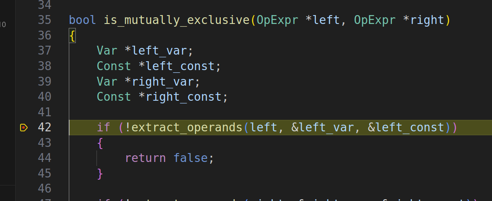

Сделаем шаг внутрь функции `extract_operands`. Посмотрим, что внутри переданного
`OpExpr`.
Раскрываем его содержимое и видим множество полей. Сейчас надо посмотреть, что
находится внутри поля `args`, т.е. аргументов оператора.

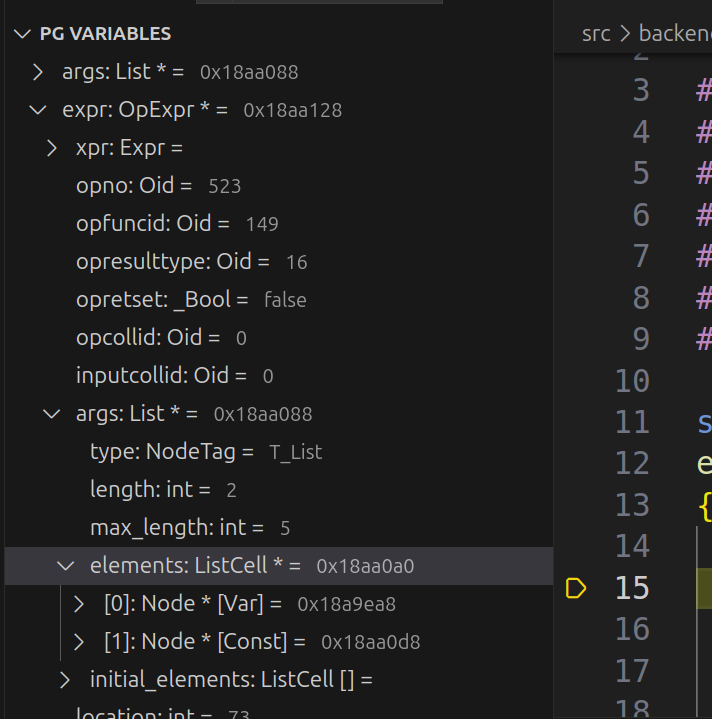

Видим, что у него 2 элемента: первый - `Var`, столбец таблицы, а второй - `Const`,
константа. Значит, наша логика получения элементов должна сработать успешно.
Доходим до конца функции - значит, все правильно.

Далее выходим из этой функции обратно и смотрим, что внутри другого `OpExpr`,в переменной `right`.

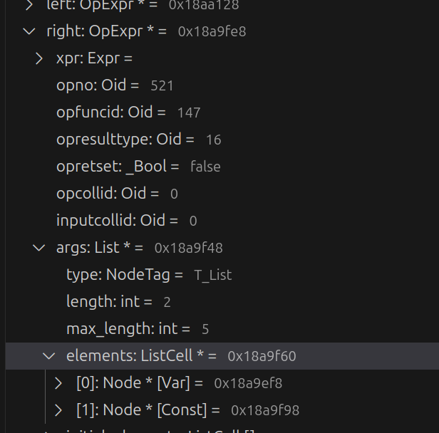

В нем та же картина - 2 аргумента - `Var` и `Const`.
Делаем несколько шагов и останавливаемся около `equal`. Эта функция должна проверить
равенство `Var`. Давайте вручную проверим их равенство. Открываем оба `Var`

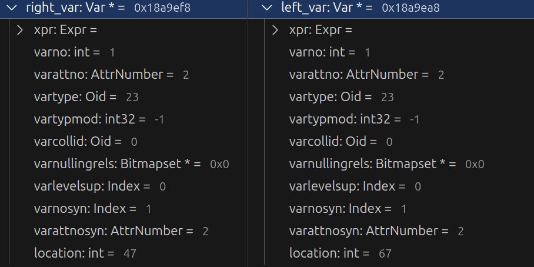

Смотрим на поля и убеждаемся, что они равны.
Различаются только поля `location`, но они нужны только для отладки, то есть проверка должна пройти.
Делаем шаг - проверка прошла успешно.
На всякий случай, проверим еще и равенство `Const` вручную.

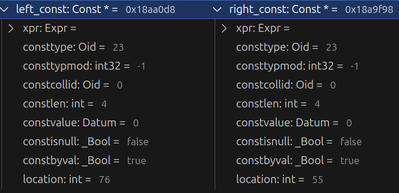

Они также равны.

Последний шаг - проверка противоположных операторов. Oid операторов хранится в поле `opno`. Посмотрим на Oid правого оператора - он равен 521. Теперь спустимся в функцию `get_negator` и дойдем до `return`, чтобы посмотреть, чему равен негатор левой части.

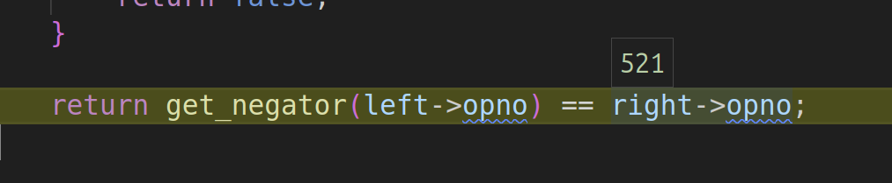

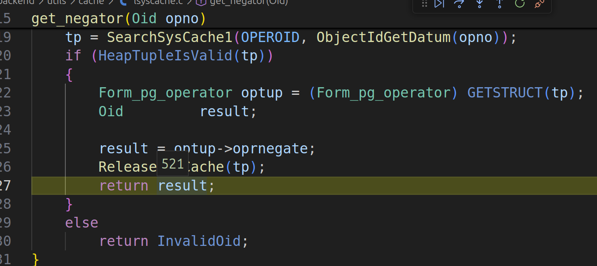

Он равен 523, то есть Oid правой части. Таким образом и работает наша логика.

Но у размещения логики на этапе предобработки дерева запроса есть недостаток -
он учитывает условия только в `WHERE`. Вот такой запрос оптимизирован не будет:

```sql
EXPLAIN ANALYZE
SELECT * FROM tbl1 t1 
    JOIN tbl2 t2 
       ON t1.value > 0 
    WHERE t1.value <= 0;
```

Это может исправить планировщик, знающий о таких ограничениях. Следующее место,
куда мы добавим оптимизацию во 2 этап работы планировщика, сделаем эту оптимизацию частью
его работы.

Грубо говоря, работа планировщика начинается в `query_planner`, так как там
инициализируются поля `PlannerInfo`, необходимые для работы планировщика. Нас
интересует `simple_rel_array` - массив, который хранит в себе `RelOptInfo`.
Напомню, что `RelOptInfo` - это структура, представляющая информацию о таблице.

Новая логика будет работать аналогично той, что была в предобработке дерева запроса:
проходим весь список ограничений и, когда находим взаимоисключающие, заменяем весь
список на список из единственного `FALSE`.

В `RelOptInfo` нам нужно работать с полем `baserestrictinfo` - список из
ограничений, наложенных на таблицу. Если в JOIN'е были условия, которые относились
только к 1 таблице, то они попадут в этот список вместе с условиями из `WHERE`.

Напишем функцию, которая будет применять логику к одному `RelOptInfo` - обходим
весь список ограничений и, когда находим 2 рядом стоящих `OpExpr` подходящих под
шаблон, заменяем весь список на список из единственного `FALSE`.
Ее сигнатура будет следующей:

```c
static void
collapse_mutually_exclusive_quals_for_rel(PlannerInfo *root, RelOptInfo *rel)
{
}
```

Вначале, проверим что у нас как минимум 2 ограничения (условия). В противном случае,
находить нечего.

```c
static void
collapse_mutually_exclusive_quals_for_rel(PlannerInfo *root, RelOptInfo *rel)
{
    /* Как минимум 2 условия */
    if (list_length(rel->baserestrictinfo) < 2)
    {
        return;
    }
}
```

Теперь начнется основная логика. Нам необходимо пройтись по всему списку и обнаружить 2 рядом стоящих взаимоисключающих `OpExpr`.
Для упрощения кода, мы сразу прочитаем первый элемент этого списка и итерироваться начнем с 1 (индексация с 0).

```c
static void
collapse_mutually_exclusive_quals_for_rel(PlannerInfo *root, RelOptInfo *rel)
{
    ListCell *lc;
    RestrictInfo *prev_rinfo;

    /* Получаем первый элемент */
    prev_rinfo = linitial(rel->baserestrictinfo);

    /* Итерируемся со 2 */
    for_each_from(lc, rel->baserestrictinfo, 1)
    {
        /* Читаем очередной элемент */
        RestrictInfo *cur_rinfo = (RestrictInfo *)lfirst(lc);
        /* ... */
    }
}
```

В 1-ой итерации цикла нам необходимо выполнить проверку - предыдущий и текущий `OpExpr` взаимоисключающие.
Это мы сделаем за 2 шага: проверим, что оба условия - `OpExpr`, и проверим, что они взаимоисключающие (ранее написанная функция).

```c
static void
collapse_mutually_exclusive_quals_for_rel(PlannerInfo *root, RelOptInfo *rel)
{
    /* ... */

        /* Оба выражения - вызовы операторов */
    if (IsA(prev_rinfo->clause, OpExpr) && IsA(cur_rinfo->clause, OpExpr) &&
        /* Выражения взаимоисключающие */
        is_exclusive_range((OpExpr *)prev_rinfo->clause, (OpExpr *)cur_rinfo->clause))
    {
        /* ... */
    }
}
```

Осталось только заменить весь список условий, на список из 1 константного `FALSE`.
Здесь нам понадобятся 2 функции для создания узлов: `make_restrictinfo` - для
создания `RestrictInfo` (ограничения) и `makeBoolConst` - для создания константного
`boolean`.

```c
static void
collapse_mutually_exclusive_quals_for_rel(PlannerInfo *root, RelOptInfo *rel)
{
    /* ... */

    /* Создаем ограничение */
    RestrictInfo *false_rinfo = make_restrictinfo(root,
                                                  /* Создаем константый `FALSE` */
                                                  (Expr *)makeBoolConst(false, false),
                                                  false, false, false, false,
                                                  0, NULL, NULL, NULL);
    /* Создаем список из 1 элемента */
    rel->baserestrictinfo = list_make1(false_rinfo);
}
```

Осталось добавить обновление предыдущего элемента после каждой итерации.
Вся функция выглядит следующим образом:

```c
static void
collapse_mutually_exclusive_quals_for_rel(PlannerInfo *root, RelOptInfo *rel)
{
    ListCell *lc;
    RestrictInfo *prev_rinfo;

    if (list_length(rel->baserestrictinfo) < 2)
    {
        return;
    }

    prev_rinfo = linitial(rel->baserestrictinfo);

    for_each_from(lc, rel->baserestrictinfo, 1)
    {
        RestrictInfo *cur_rinfo = (RestrictInfo *)lfirst(lc);
        if (IsA(prev_rinfo->clause, OpExpr) && IsA(cur_rinfo->clause, OpExpr) &&
            is_mutually_exclusive((OpExpr *)prev_rinfo->clause, (OpExpr *)cur_rinfo->clause))
        {
            RestrictInfo *false_rinfo = make_restrictinfo(root,
                                                          (Expr *)makeBoolConst(false, false),
                                                          false, false, false, false,
                                                          0, NULL, NULL, NULL);
            rel->baserestrictinfo = list_make1(false_rinfo);
            return;
        }
        
        prev_rinfo = cur_rinfo;
    }
}
```

В каждом запросе может быть несколько отношений. Поэтому применить эту логику
стоит ко всем ним.
`RelOptInfo` хранятся в массиве `simple_rel_array` структуры `PlannerInfo`.
Нам нужно просто обойти каждый элемент этого массива и применить `collapse_mutually_exclusive_quals_for_rel`.

Функция логикой обхода содержится в `collapse_mutually_exclusive_quals`.
Ее сигнатура:

```c
void 
collapse_mutually_exclusive_quals(PlannerInfo *root)
{
}
```

Нам необходимо пройти весь массив `simple_rel_array`. Здесь стоит учесть, что
его индексация начинается с 1, на 0 индексе всегда NULL.

```c
void 
collapse_mutually_exclusive_quals(PlannerInfo *root)
{
    /* Индексация с 1, не с 0 */
    for (size_t i = 1; i < root->simple_rel_array_size; i++)
    {
        RelOptInfo *rel = root->simple_rel_array[i];
    }
}
```

`RelOptInfo` может быть создан как для таблиц, так и для `JOIN`'ов, функций или индексов.
Поэтому нам необходимо проверить тип этого отношения.
Мы могли бы проверить, что перед нами таблица, но лучше использовать другой подход -
проверять, что перед нами base rel. Ими могут быть не только таблицы, но и
функции или подзапросы. Логика Constraint Exclusion может применяться и к ним.

Поэтому будем проверять, что перед нами base rel. Таким образом, мы расширим круг
применения оптимизации.
Эта информация хранится в поле `reloptkind` структуры `RelOptInfo`

```c
void 
collapse_mutually_exclusive_quals(PlannerInfo *root)
{
    for (size_t i = 1; i < root->simple_rel_array_size; i++)
    {
        RelOptInfo *rel = root->simple_rel_array[i];
        
        /* Проверяем, что отношение базовое, base rel */
        if (rel->reloptkind == RELOPT_BASEREL)
        {
            collapse_mutually_exclusive_quals_for_rel(root, rel);
        }
    }
}
```

Все функции вместе:

```c
static void
collapse_mutually_exclusive_quals_for_rel(PlannerInfo *root, RelOptInfo *rel)
{
    ListCell *lc;
    RestrictInfo *prev_rinfo;

    if (list_length(rel->baserestrictinfo) < 2)
    {
        return;
    }

    prev_rinfo = linitial(rel->baserestrictinfo);

    for_each_from(lc, rel->baserestrictinfo, 1)
    {
        RestrictInfo *cur_rinfo = (RestrictInfo *)lfirst(lc);

        if (IsA(prev_rinfo->clause, OpExpr) && IsA(cur_rinfo->clause, OpExpr) &&
            is_mutually_exclusive((OpExpr *)prev_rinfo->clause, (OpExpr *)cur_rinfo->clause))
        {
            RestrictInfo *false_rinfo = make_restrictinfo(root,
                                                          (Expr *)makeBoolConst(false, false),
                                                          false, false, false, false,
                                                          0, NULL, NULL, NULL);
            rel->baserestrictinfo = list_make1(false_rinfo);
            return;
        }
        
        prev_rinfo = cur_rinfo;
    }
}

void 
collapse_mutually_exclusive_quals(PlannerInfo *root)
{
    for (size_t i = 1; i < root->simple_rel_array_size; i++)
    {
        RelOptInfo *rel = root->simple_rel_array[i];

        if (rel->reloptkind == RELOPT_BASEREL)
        {
            collapse_mutually_exclusive_quals_for_rel(root, rel);
        }
    }
}
```

Осталось понять куда эту логику добавлять:

1. Мы используем список `baserestrictinfo`
2. Этот список находится в `RelOptInfo`
3. Они сами хранятся в массиве `simple_rel_array`

Логично добавить эту логику тогда, когда будет проинициализирован массив `simple_rel_array`
с необходимыми `RelOptInfo`.
Этот массив создается в функции `add_base_rels_to_query`, а вызывается в функции `query_planner` в файле `planmain.c`.

Добавим нашу логику сразу после создания массива `simple_rel_array`.

```c
RelOptInfo *
query_planner(PlannerInfo *root,
			  query_pathkeys_callback qp_callback, void *qp_extra)
{
    /* ... */
    add_base_rels_to_query(root, (Node *) parse->jointree);

    /* Логика Constraint Exclusion */
    collapse_mutually_exclusive_quals(root);
}
```

> Не забываем удалить код из работы 1 этапа (предобработка дерева запрса) в файле `clause.c`

Останавливаем старую БД, перекомпилируем, запускаем PSQL и выполняем запрос:

```text
                                          QUERY PLAN                                           
-----------------------------------------------------------------------------------------------
 Seq Scan on tbl  (cost=0.00..43.90 rows=11 width=4) (actual time=0.007..0.008 rows=0 loops=1)
   Filter: ((value > 0) AND (value <= 0))
 Planning Time: 0.042 ms
 Execution Time: 0.020 ms
(4 rows)
```

Наш патч не сработал, планировщик все же решил использовать сканирование таблицы.

Давайте запустим отладчик и посмотрим, что произошло. Поставим точку останова в функции `collapse_mutually_exclusive_quals` и запустим запрос.

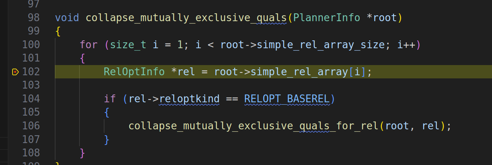

Пройдя несколько шагов замечаем, что проверка на размер списка `baserestrictinfo` не прошла.
Если посмотреть, что внути этого списка, то окажется, что он пуст (NULL - пустой список).

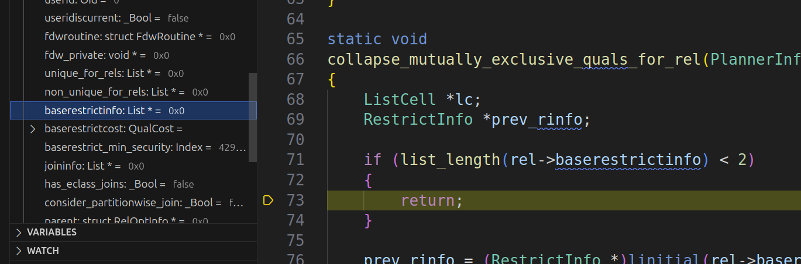

Причина этого следующая - практически все основные структуры как `PlannerInfo`
или `RelOptInfo` заполняются по мере работы, а не сразу. Мы предположили, что
раз `add_base_rels_to_query` создает этот массив, то и каждый элемент уже должен
быть проинициализирован, но это не так. Чтобы починить это, необходимо опустить
функцию ниже, туда где `baserestrictinfo` проинициализирован ограничениями - после
вызова `deconstruct_join_tree`.

```c
RelOptInfo *
query_planner(PlannerInfo *root,
			  query_pathkeys_callback qp_callback, void *qp_extra)
{
    /* ... */
    joinlist = deconstruct_jointree(root);

    /* Опустили вызов Constraint Exclusion */
    collapse_mutually_exclusive_quals(root);
}
```

Остановим БД, перекомпилируем и запустим запрос снова:

```text
                                     QUERY PLAN                                     
------------------------------------------------------------------------------------
 Result  (cost=0.00..0.00 rows=0 width=0) (actual time=0.001..0.002 rows=0 loops=1)
   One-Time Filter: false
 Planning Time: 0.125 ms
 Execution Time: 0.012 ms
(4 rows)
```

Логика применилась успешно.
Теперь, проверим поведение для запроса, где часть условий вынесена в `JOIN`:

```sql
EXPLAIN ANALYZE 
SELECT * FROM tbl1 t1 
JOIN tbl2 t2 
   ON t1.value > 0 
WHERE t1.value <= 0;
```

Запускаем запрос и получаем следующий результат:

```text
postgres=# EXPLAIN ANALYZE 
SELECT * FROM tbl1 t1 
JOIN tbl2 t2 
   ON t1.value > 0 
WHERE t1.value <= 0;
server closed the connection unexpectedly
        This probably means the server terminated abnormally
        before or while processing the request.
The connection to the server was lost. Attempting reset: Failed.
The connection to the server was lost. Attempting reset: Failed.
!?> 
```

**Что-то пошло не так**. Бэкэнд отвалился и мы больше не можем отправлять запросы.

Давайте снова запустим этот запрос, но уже под отладчиком. Также поставим точку
останова на функции `collapse_mutually_exclusive_quals` и запустим запрос.

Получаем первый `RelOptInfo` и проходим проверку на base rel. Она прошла, т.к.
это отношение таблица.

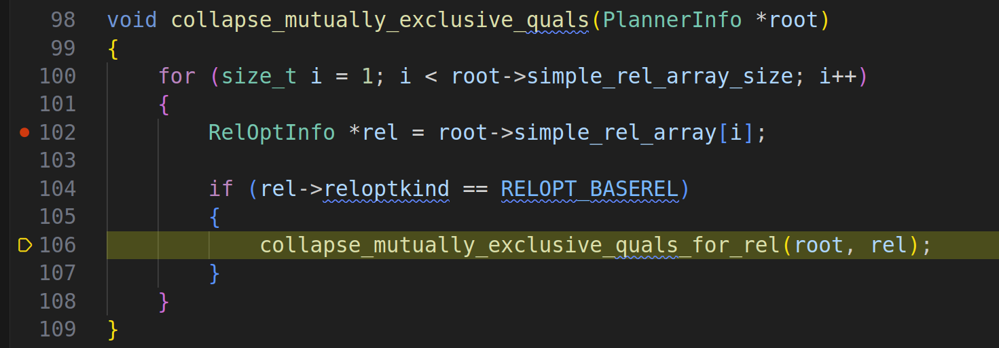

В самой функции мы проходим проверку на размер списка `baserestrictinfo`.
В этом списке оказывается 2 `RestrictInfo`. Оба с `OpExpr` и у каждого `Var`
и `Const`.
Здесь можем заключить, что планировщик перенес условие из `JOIN` внутрь `WHERE`.

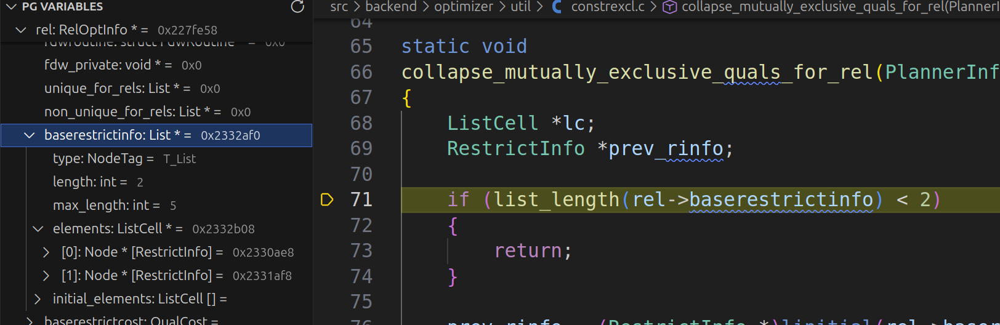

Далее, начинаем итерироваться и проходим проверку на взаимоисключение.

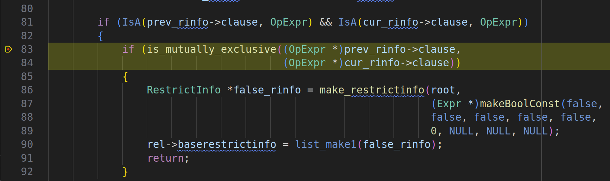

Она прошла и теперь нам надо создать список из единственного `FALSE`.
Мы его успешно создали и теперь в `baserestrictinfo` хранится единственный `FALSE`.

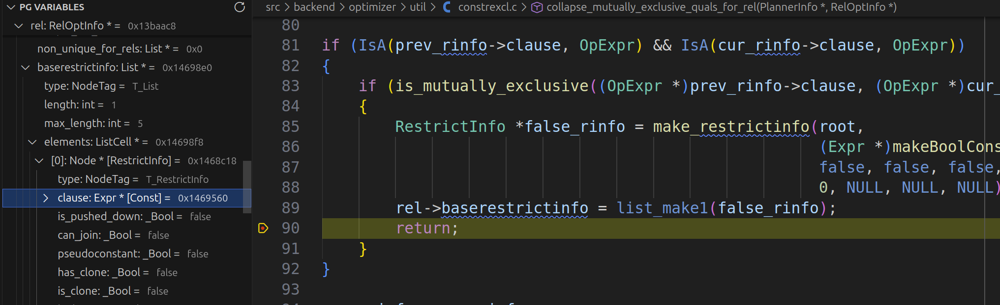

После мы заканчиваем итерацию и идем к следующему отношению.
Оно также проходит проверку на base rel, но проверку на количество ограничений
в `baserestictinfo` не проходит. Этот список пуст. Это `tbl2` - на него
мы не накладывали ограничений.

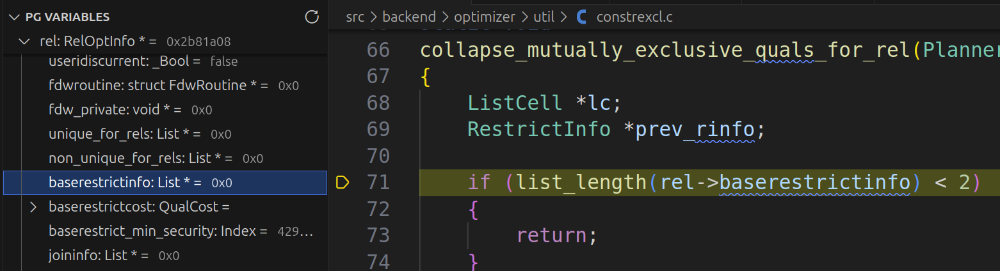

Теперь заходим на последнюю итерацию в `simple_rel_array`. И вот тут мы ловим
`SEGFAULT`, когда пытаемся понять тип очередного `RelOptInfo`.

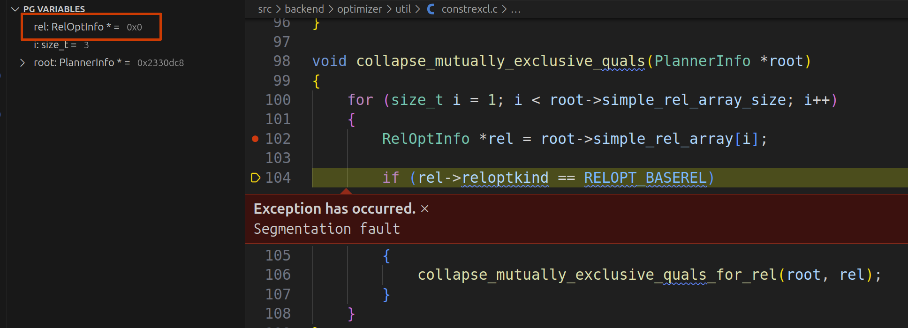

Если посмотрим в окне переменных, то заметим, что эта переменная - `NULL`.

Это вполне валидная ситуация. Причина в том, что массив `simple_rel_array` создается
из `simple_rte_array` - на соответствующих индексах хранятся `RelOptInfo` для
отношений.
Индекс `rel`, который был `NULL` - 3. Посмотрим, что было в соответствующем `simple_rte_array`.

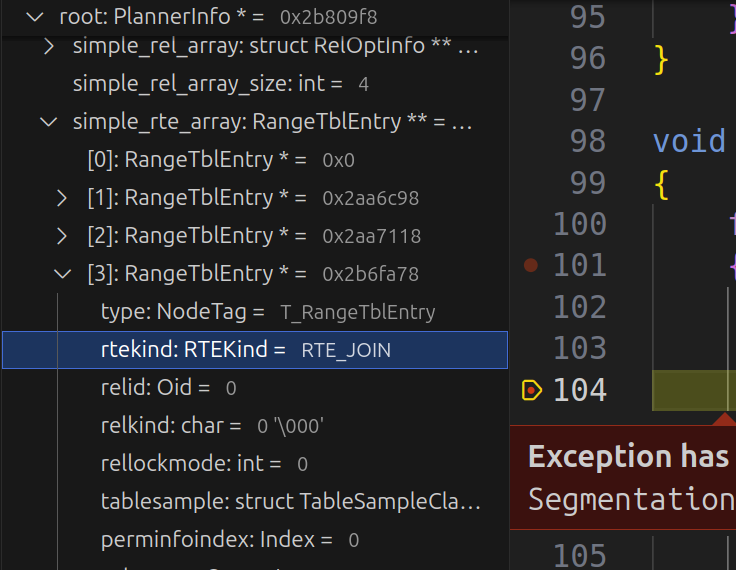

В нем оказался JOIN, но в `simple_rel_array` хранятся `RelOptInfo` для отношений, но не JOIN'ов.

Исправление бага простое - добавить проверку на NULL:

```c
void 
collapse_mutually_exclusive_quals(PlannerInfo *root)
{
    for (size_t i = 1; i < root->simple_rel_array_size; i++)
    {
        RelOptInfo *rel = root->simple_rel_array[i];

        if (rel != NULL && rel->reloptkind == RELOPT_BASEREL)
        {
            collapse_mutually_exclusive_quals_for_rel(root, rel);
        }
    }
}
```

Но на всякий случай, добавим `Assert` в `collapse_mutually_exclusive_quals_for_rel`:

```c
static void
collapse_mutually_exclusive_quals_for_rel(PlannerInfo *root, RelOptInfo *rel)
{
	ListCell *lc;
	RestrictInfo *prev_rinfo;

    Assert(rel != NULL);

	if (list_length(rel->baserestrictinfo) < 2)
	{
		return;
	}

	/* ... */
}
```

Остановим БД, перекомпилируем и запустим запрос заново:

```text
                                     QUERY PLAN                                      
-------------------------------------------------------------------------------------
 Result  (cost=0.00..0.00 rows=0 width=24) (actual time=0.002..0.002 rows=0 loops=1)
   One-Time Filter: false
 Planning Time: 0.046 ms
 Execution Time: 0.012 ms
(4 rows)
```

Баг починен и логика применилась успешно. Запрос выполнился успешно.

Стоит сделать замечание, что вот так удалять информацию о запросе не самая лучшая
идея, так как мы уменьшаем известную нам информацию, а также тратим
дополнительные ресурсы на эти операции. Поэтому лучшим вариантом будет просто
использовать эти знания непосредственно при создании путей.

Вот мы и пришли к реализации в самом Postgres. Constraint Exclusion - это одна
из оптимизаций, которая включается GUC параметром `constraint_exclusion` и
проводится непосредственно перед вычислением стоимости пути. И там используется
примерно та же логика, что и наша. Например, вот кусок кода, обнаруживающий
противоположные операторы:

```c
static bool
operator_predicate_proof(Expr *predicate, Node *clause,
                         bool refute_it, bool weak)
{
    OpExpr *pred_opexpr,
           *clause_opexpr;
    Oid pred_collation,
        clause_collation;
    Oid pred_op,
        clause_op,
        test_op;
    Node *pred_leftop,
         *pred_rightop,
         *clause_leftop,
         *clause_rightop;

    /*
     * Both expressions must be binary opclauses, else we can't do anything.
     *
     * Note: in future we might extend this logic to other operator-based
     * constructs such as DistinctExpr.  But the planner isn't very smart
     * about DistinctExpr in general, and this probably isn't the first place
     * to fix if you want to improve that.
     */
    if (!is_opclause(predicate))
        return false;
    pred_opexpr = (OpExpr *) predicate;
    if (list_length(pred_opexpr->args) != 2)
        return false;
    if (!is_opclause(clause))
        return false;
    clause_opexpr = (OpExpr *) clause;
    if (list_length(clause_opexpr->args) != 2)
        return false;

    /*
     * If they're marked with different collations then we can't do anything.
     * This is a cheap test so let's get it out of the way early.
     */
    pred_collation = pred_opexpr->inputcollid;
    clause_collation = clause_opexpr->inputcollid;
    if (pred_collation != clause_collation)
        return false;

    /* Grab the operator OIDs now too.  We may commute these below. */
    pred_op = pred_opexpr->opno;
    clause_op = clause_opexpr->opno;

    /*
     * We have to match up at least one pair of input expressions.
     */
    pred_leftop = (Node *) linitial(pred_opexpr->args);
    pred_rightop = (Node *) lsecond(pred_opexpr->args);
    clause_leftop = (Node *) linitial(clause_opexpr->args);
    clause_rightop = (Node *) lsecond(clause_opexpr->args);

    if (equal(pred_leftop, clause_leftop))
    {
        if (equal(pred_rightop, clause_rightop))
        {
            /* We have x op1 y and x op2 y */
            return get_negator(pred_op) == clause_op;
        }
    }
    /* Omitted */
}
```

## Советы как упростить себе жизнь при отладке

В конце, хотелось бы дать несколько советов как можно упростить себе жизнь, при
работе с планировщиком.

### Отключаем запрос пароля

При присоединении отладчика к другому процессу запрашивается пароль. Это
поведение можно отключить:

- В конфигурационном файле `/etc/sysctl.d/10-ptrace.conf` - необходимо выставить
    параметр `kernel.yama.ptrace_scope = 0`

- Записав `0` в файл `/proc/sys/kernel/yama/ptrace_scope`. Пример такой команды:
    `echo 0 | sudo tee /proc/sys/kernel/yama/ptrace_scope`

Замечания:

- При 1 способе изменения вступят в силу после перезагрузки
- При 2 способе сразу, но придется выполнять эту команду постоянно

У себя я использую 1 способ, так удобнее.

### Выводим PID бэкэнда сразу

У `psql` есть конфигурационный файл `.psqlrc`. Все команды из него выполняются
каждый раз при запуске. Пример такого файла:

```sql
SELECT pg_backend_pid();
```

Через переменную окружения `PSQLRC` можно передать путь к `.psqlrc`. Пример:

```bash
PSQLRC="./build/.psqlrc" psql postgres
```

После запуска отобразится PID нашего бэкэнда.

> При интеграции с VS Code можно добиться того, чтобы не вводить PID процесса, а
> сразу подключаться к нужному бэкэнэду. Пример такой настройки есть в
> репозитории.

### Средства PostgreSQL

В PostgreSQL существуют встроенные средства для отладки планировщика. В общем,
они все выводят в лог содержимое узла.

#### Функции вывода

В заголовочном файле `print.h` объявлено множество функций для вывода в лог
содержимого переданного узла. Формат сериализации - собственный, не JSON или
какой-нибудь другой.

Базовая функция - `pprint`, она выводит в лог любой переданный узел.

> Выводит в `stdout`. Если вывод никуда не сохраняется, то его можно потерять

Также есть и несколько специализированных. Например, `print_rt` - выводит в лог
список из `Range Table Entry` с форматированием как таблиц.

Все остальные механизмы используют `pprint` под капотом.

#### Макросы

Иммется 2 макроса, связанных с планировщиком. Их необходимо включать во время компиляции:

- `OPTIMIZER_DEBUG` - общая работа планировщика
- `GEQO_DEBUG` - Genetic Query Optimizer

Если они были включены, то после определенного этапа работы в лог будет выводиться
состояние планировщика.

#### Параметры конфигурации

Существует несколько параметров конфигурации (postgresql.conf), полезных для отладки планировщика:

- `debug_print_parse`
- `debug_print_rewritten`
- `debug_print_plan`

Если параметр выставлен в `on`, то после соответствующего этапа (парсинг дерева запроса,
переписывание, планирование) в лог будет выводиться результат работы этого этапа (дерево запроса или план выполнения).

Но они выводят уже готовый результат, без пошагового изменения состояния.

### Автоматизация

При работе с PostgreSQL можно выделить 4 основных этапов:

- Настройка (вызов `configure` скрипта)
- Сборка
- Запуск тестов
- Запуск БД и psql

Для каждого из этапов можно создать скрипты. Но большую выгоду мы можем получить,
если интегрируем эти скрипты в VS Code. Это можно сделать через таски - для
каждого скрипта создаем свои таски. Например, таска сборки может выглядеть таким
образом:

```json
{
    "label": "Build",
    "detail": "Build PostgreSQL and install into directory",
    "type": "shell",
    "command": "${workspaceFolder}/build.sh",
    "problemMatcher": [],
    "group": {
        "kind": "build",
        "isDefault": true
    }
}
```

В директории [`dev`](./dev) расположены скрипты, которые помогут в разработке PostgreSQL.
А в директории [`.vscode`](./.vscode) - конфигурация для VS Code, которая их дополняет.

### Расширение для PostgreSQL

Раз мы говорим про VS Code, то стоит рассказать и о расширениях. Одно из
полезных - это `PostgreSQL Hacker Helper`.

Главная фича - просмотр переменных узлов. Расширение о них знает и когда встречает
такое, то получает его реальный тип, используя тэг, а затем отображает в соответствии
с этим типом (производит каст к реальному типу).

При отладке уже могли заметить это окно. С его помощью мы смотрели внутрь `OpExpr`,
искали `Var`, `Const`, а также отлаживали планировщик, когда получили `SEGFAULT`.

Расширение знает и об узлах-контейнерах - `List` и `Bitmapset`. Оно отображает
все их элементы (с использованием приведения к реальному типу узлов).

Также имеется поддержка C-массивов - указателей на массив, длина которых хранится
в другом поле. Мы также могли это видеть, когда смотрели внутрь `simple_rte_array`.

Расширение поддерживает практически все версии PostgreSQL. Тестировал на версиях,
начиная с 8. Но если, чего-то нет, то поддержку для этого можно добавить с
помощью конфигурационного файла.

Ссылка на расширение [здесь](https://marketplace.visualstudio.com/items?itemName=ash-blade.postgresql-hacker-helper).

## Итоги

Подытожим что сделали:

- Изучили общий план работы планировщика, основные этапы и функции
- Познакомлись с узлами: тэги, наследование, полезные функции и макросы
- Добавили оптимизацию в планировщик
- Запустили код под отладкой и исправили баг

## Задания

В качестве упражнений предлагается сделать несколько доработок.

> Для каждого из заданий имеется файл с решением - это патч.
> Его нужно применить к исходным файлам Postgres 16.4 (та версия, что скачивалась).
>
> Исходные файлы СУБД можно получить, если заново разархивировать `postgresql-16.4.tar.gz` с помощью
> команды `tar xvf postgresql-16.4.tar.gz`. Далее необходимо применить нужный патч.
> Например, с помощью команды `patch` (внутри директории с исходными файлами):
> `patch -p1 PATCH_FILE` (`PATCH_FILE`) - файл с патчем, указан для каждого задания.
>
> `tar` все файлы кладет в директорию `postgresql-16.4`. Если она уже есть, то
> возникнет ошибка. Чтобы исправить это просто уберите уже существующую директорию
> (удалить, переместить, переименовать)

### Учет изменчивых функций

Так как операторы - это тоже функции, то есть у них тоже есть категория изменчивости.
Речь идет о модификаторах `VOLATILE`, `STABLE` и `IMMUTABLE`.

В текущей реализации это не проверялось, но сейчас необходимо добавить эту проверку.
Мы не должны использовать операторы, которые могут зависеть от окружения, они
должны всегда возвращать один и тот же результат на тот же самый вход всегда.

Пример этой доработки находится в патче `patches/VolatileCheck.patch`.

> Подсказка: в заголовочном файле `lsyscache.h` есть функция `func_volatile` -
> она возвращает тип изменчивости функции.

### Взаимодополняющие условия

Мы реализовали взаимо**исключающие**, то есть когда 2 выражения **противоречат** друг другу.
Теперь необходимо реализовать противоположную логику - когда 2 выражения
**дополняют** друг друга так, что их оба можно заменить на `TRUE` (вместо `FALSE`).

Например, в таком запросе можно исключить `WHERE`:

```sql
SELECT * FROM tbl t
WHERE t1.value > 0 
   OR 
      t1.value <= 0;
```

Пример этой доработки находится в патче `patches/ComplementaryClauses.patch`

> Подсказка: в списке `baserestrictinfo` все элементы - это неявные аргументы для
> `AND` условия. Поэтому в нашем коде мы не искали `BoolExpr` - булева выражения.
> Теперь, нам надо найти элемент в `baserestrictinfo`, который представляет собой
> `OR` условие.

### Классы эквивалентности

Сейчас мы проверяли только те же самые столбцы - те же самые атрибуты из той же
самой таблицы. Теперь, необходимо сделать доработку - обнаружить ситуации, когда
столбцы могут принадлежать разным таблицам, но учитывая другие ограничения,
они имеют одинаковое значение.

Для примера, взглянем на следующий запрос:

```sql
SELECT * FROM tbl1 t1
JOIN tbl2 t2
ON t1.id = t2.id
WHERE t1.value = t2.value
      AND
      t1.value > 0
      AND
      t2.value <= 0;
```

Видим, что имеется схожий паттерн, но столбцы таблиц - разные. Хотя, зная, что
`t1.value = t2.value` мы можем заключить, что условие `t1.value > 0 AND t2.value <= 0`
подходит под наше условие - мы можем заменить `t1.value` на `t2.value` или наоборот.

Пример реализации находится в файле [`patches/EquivalenceClass.patch`](patches/EquivalenceClass.patch).

> Подсказка: для реализации необходимо использовать структуру `EquivalenceClass`.
> Это специальная структура, которая хранит в себе информацию об одинаковых (по
> результату вычисления) выражениях. В примере из запроса он будет хранить
> `t1.value` и `t2.value`.
> Найти EC можно в поле `eclass_indexes` из `RelOptInfo` и поле `eq_classes` из
> `PlannerInfo`.
