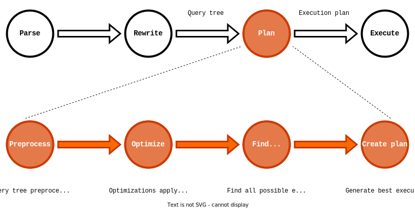
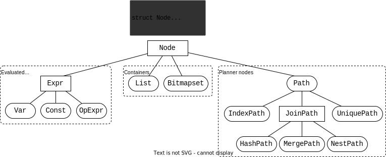

# PostgreSQL planner development and debugging

In this post we will look at how the PostgreSQL planner works, but on code level (functions and data structures) and how to hack on them.

- Go over the main functions used by the planner, main pipeline
- Get acquainted with the type system: `Node` and it's children
- How query is represented in code and different data structures that represent it's parts

After some theory we will implement and add a little feature into the planner.

## Setting up

If you want to reproduce some parts of this post, then you need to setup repository.

All you need to do is to run `init.sh`. This script:

1. Downloads PostgreSQL 16.4
2. Applies patch
3. Copies development scripts
4. If VS Code is installed:
   1. Copies configuration files to `.vscode` folder
   2. Installs required extensions

> For source code downloading you also need to have `wget` or `curl` and `tar` to unzip.
> If they are missing install them manually or download archive manually using [this link](https://ftp.postgresql.org/pub/source/v16.4/postgresql-16.4.tar.gz) and store it in same directory as `init.sh` script.

For building and debugging PostgreSQL you also need to have these libraries/executables installed:

- `libreadline`
- `bison`
- `flex`
- `make`
- `gcc`
- `gdb` (or another debugger)
- `CPAN` (for PERL)

You can install them in such way:

```shell
# Debian based
sudo apt update
sudo apt install build-essential gdb bison flex libreadline-dev git

# RPM based
sudo yum update
sudo yum install gcc gdb bison flex make readline-devel perl-CPAN git
```

So, whole setup pipeline is this:

```shell
# Clone repository and go to directory with meetup files
git clone https://github.com/TantorLabs/meetups
cd "meetups/2024-09-17_Kazan/Sergey Solovev - Debugging PostgreSQL planner"


# Run initialization script: files downloading, applying patches, etc...
./init.sh

# Go to PostgreSQL source code directory
cd postgresql

# Run build using dev script (parallel with 8 threads)
./dev/build.sh -j 8

# Initialize DB and setup schema for tests
./dev/run.sh --init-db --run-db --psql --script=../schema_constrexcl.sql --stop-db

# Run VS Code (if you have) and open main work file
code . --goto src/backend/optimizer/util/constrexcl.c
```

After this you can run scripts in `queries_constrexcl.sql` using `psql`.

We will work with files:

- `src/backend/optimizer/util/constrexcl.c`
- `src/backend/optimizer/util/clauses.c`
- `src/backend/optimizer/plan/planmain.c`

For full-fledged debugging you should install extra dependencies:

- `icu-i18n`
- `zstd`
- `zlib`
- `pkg-config`

And PERL package `IPC::Run`.

## High-level planner architecture

Now the theory comes in. I will explain some parts not digging too dip. But if you want to touch hard parts you are welcome to READMEs - you can find many of them in PostgreSQL source code repository in `src/backend/optimizer`. These READMEs explain multiple aspects of the planner workflow.

### Query processing algorithm

Let's kick off with query processing pipeline. It can be represented as 4 distinct stages:

1. Parsing
2. Rewriting
3. Planning
4. Execution



As you can guess we will talk about 3 stage - planning. It also can be divided into 4 stages:

1. Preprocessing
2. Optimization
3. Finding possible paths
4. Plan creation

1 and 2 stages perform some optimizations. Main difference that the `Preprocessing` works with `Query tree` and make "simple" optimizations, i.e. constant folding (calculate result of constant expressions).
But `Optimization` makes harder optimizations. Such optimizations works with "whole-query" knowledge: JOINs, constants, partitions, tables etc.

During 3 stage we find all possible (excluding those that known to be surely inefficient) ways to execute this query. i.e. table has indexes and after we performed some optimization it may be turned out, that we may not use explicit sorting, because `Index only scan` provides already sorted data.

On the last stage we find the best path for which we create execution *plan*. This plan will be used by Executor to actually run query.

### Source code organization

In source code these stages organized in such way.

We have "main" functions - entry points for "main" activity:

- `query_planner` - creates access paths for tables (i.e. `SeqScan`, `IndexScan` etc..) and also creates and initializes main data structures for further use.
- `grouping_planner` - wrapper for `query_planner` that adds postprocessing logic after we retrieve data from tables: sorting, grouping etc...
- `subquery_planner` - entry point for planning single subquery. It is called each time we encounter new subquery (recursively).
- `standard_planner` - entry point for whole planner.

Schematically, this can be represented this way.

On top we have `standard_planner`. It prepares environment and calls `subquery_planner` for top query (top query is also a subquery, but without parent).

`subquery_planner` preprocess *query tree* and calls `grouping_planner` for running main planning logic.

`grouping_planner` runs `query_planner` and after that adds some postprocessing nodes for query plan: sorting, grouping, window functions etc...

`query_planner` initializes state of planner and performs optimizations. After optimizations it calls `make_one_rel` to actually find best access path.

`make_one_rel` finds best access path for whole relation (including strategy for JOIN search).

`standard_join_search` determines best JOIN strategy. It uses dynamic programming algorithm in opposite to GEQO (Genetic Query Optimizer) which is called when `geqo_threshold` number of tables in single JOIN reached.

```c
standard_planner()
{
    /* Initialize global planner state */
    subquery_planner()
    {
        /* Query tree preprocessing */
        grouping_planner()
        {
            /* Process GROUP operations: SORT, GROUP BY, WINDOW, SET ops */
            query_planner()
            {
                /* Planner state initialization */
                /* Optimizations */
                /* Find access paths */
                make_one_rel()
                {
                    /* JOIN strategy */
                    standard_join_search()
                }
            }
            /* Add postprocessing nodes (group, sort, etc...) */
        }
        /* Best path choose */
    }
    /* Generating plan for best path */
}
```


## Data structures

Now let's talk about type system.

### Nodes and trees

PostgreSQL has it's own type system based on C-style inheritance.

`Node` - is a base structure for all. It has single member with type `NodeTag` - type discriminator.

This is simple `enum` which is created as `T_` prefix + name of structure.

All possible nodes are already known, their values defined in `src/include/nodes/node.h` header file, or, starting with 16 version, are generated using code-gen in `src/include/nodes/nodetags.h`.

Implementations of these nodes stored in header files in `src/include/nodes`. Such files ends with `*nodes.h`:

- `src/include/nodes/primnodes.h`
- `src/include/nodes/pathnodes.h`
- `src/include/nodes/plannodes.h`
- `src/include/nodes/execnodes.h`
- `src/include/nodes/memnodes.h`
- `src/include/nodes/miscnodes.h`
- `src/include/nodes/replnodes.h`
- `src/include/nodes/parsenodes.h`
- `src/include/nodes/supportnodes.h`

### Node examples

This diagram shows tree with several Node types grouped by purpose (in my opinion). Totally, there are about 500 types, so take a look at most used ones.



`List` - is a dynamic array. It can store `void *`, `int`, `Oid` or `TransactionId` (only one specific type). Using it's tag we can define this data is stored in it:

| Type            | `NodeTag`   |
| --------------- | ----------- |
| `void *`        | `T_List`    |
| `int`           | `T_IntList` |
| `Oid`           | `T_OidList` |
| `TransactionId` | `T_XidList` |

NOTE: `List` is unique in way has 4 different tags for single structure.

`Expr` - is a base structure for nodes, which can be executed (expressions). You can encounter them in attribute list of `SELECT` or `WHERE` constraints. Examples:

| Structure  | Description        | Evaluation result                                     |
| ---------- | ------------------ | ----------------------------------------------------- |
| `Var`      | Table column       | Value of specified column in tuple of specified table |
| `Const`    | Constant           | Constant value                                        |
| `OpExpr`   | Operator           | Operator invocation with specified arguments          |
| `FuncExpr` | Function           | Function invocation with specified arguments          |
| `BoolExpr` | Boolean expression | Evaluation of boolean expression (`NOT`, `AND`, `OR`) |
| `SubPlan`  | Sub-SELECT         | Result of SELECT query execution                      |

> `Node` and `Expr` are *abstract*, they do not have own `NodeTag` value.
> They serve as markers: `Node` - common object of PostgreSQL type system, `Expr` - expression.

One more group - are planner nodes. They are used by the planner and contain data required for convenient access, i.e. tables in JOIN stores as set, not in tree format.

### Query tree representation

First, look at how query is represented in code. This schema shows parts of query with corresponding data structures (nodes).


`Query` represents query tree for single query. If we find sub-query we create another `Query`.

Next, table representation. There is an important abstraction - `Range Table`.

Strictly speaking, `Range table` - it is everything that can be in `FROM` clause, data source. Each such element named `Range Table Entry` (rte):

- Table
- Function
- Subquery
- `JOIN`'s
- CTE
- `VALUES (), ()`

`RangeTblEntry` - is a structure, that represents Range Table Entry. To distinguish different types of RTE enum `RTEKind` is used.

For query in the example we have:

- `tbl1` - `RTE_RELATION`
- `tbl2` - `RTE_RELATION`
- `tbl1 JOIN tbl2` - `RTE_JOIN`
- `generate_series` - `RTE_FUNCTION`
- `tbl1 JOIN tbl2 LEFT OUTER JOIN generate_series` - `RTE_JOIN`
- `(SELECT MAX(id) ... )` - `RTE_SUBQUERY`

Note that each query has it's own Range Table, so `tbl3` - RTE *for subquery* and it is not in list above.

### Query representation in planner

Now, how the planner sees the same query.


Main parts:

`PlannerInfo` - information about single query (just like `Query`).

`RelOptInfo` - planner information about 1 *relation*: table, function, subqeury, CTE, JOIN etc (just like `RangeTblEntry`). To distinguish different types of relations `RelOptKind` (another enum) is used.

In previous section you can notice that some `RTEKind` are coloured. Let's draw a parallel between `RelOptKind` and `RTEKind`.

`RELOPT_BASEREL` corresponds to `RTE_RELATION` (table), `RTE_FUNCTION` (function) and `RTE_SUBQUERY` (subquery). Basically, we do not need such precise information, all we need are 2 things: name (to be able to address them) and returned attributes list.

Such relations are called *base relations*. Planner likes to work with them and knowledge of relation origin is not that important.

`RELOPT_JOINREL` is created for `RTE_JOIN`. Here we can see one more difference with query tree. In query tree we have many `RTE_JOIN` (1 for each JOIN), but one only 1. The reason of that hides in storage format - planner stores tables for join as set. This simplifies work required for optimal JOIN search.

> Another values of `RelOptKind` are not covered. But they are also useful, i.e. to support table inheritance or `UNION ALL`.

### Extra structures

In it's work planner uses multiple auxiliary data structures. Now we will cover only 2 of them: `RestrictInfo` and `EquivalenceClass`.


`RestrictInfo` is a restriction (constraint) applied to query. i.e. it can be condition from `WHERE` or `JOIN`. In schema's query there are 3 restrictions:

- `t1.id = t2.id` - `JOIN` condition
- `t1.value = t2.value` - first condition `AND` in `WHERE`
- `1.value = 0` - second condition `AND` in `WHERE`

> Any conditions/restrictions called `qualifications` (or `quals`)

`EquivalenceClass` is a set of values known to be equal to each other. In same query we have 2 equivalence classes:

- `t1.id` and `t2.id`
- `t1.value`, `t2.value` and `0`

You can note that `EquivalenceClass` created using `RestrictInfo`. Both of them (ds) are important, because the help planner to find more optimal scan paths (examples):

- `RestrictInfo` - which index to use. If we have index on `t1.value`, then we can use it because of `t1.value = 0` qualification
- `EquivalenceClass` - find dependencies between used data. If in previous example we have index on `t2.value` (not `t1.value`), then we can not use `t1.value = 0` qual, but we `t1.value` and `t2.value` are in same `EquivalenceClass`, so we transitively conclude that `t2.value = 0` and can use index.

## Implementing Constraint Exclusion

Now, we know enough to begin development of planner.

On practice we implement "Constraint Exclusion" optimization - examine provided constraints to find which are mutually exclusive and remove such relations (tables).

For example, this query can not remove any tuple:

```sql
SELECT * FROM tbl1
WHERE 
    value > 0 
  AND
    value <= 0;
```

Such pattern will have next representation in Nodes:


We are looking for:

- `BoolExpr` - boolean expression with `AND` condition, which has
- Both expressions are `OpExpr` (operator invocation), having
- Opposite operators with
- Equal (by value) operands:
- Left operand - table column (`Var`) and
- Right operand - constant (`Const`)

When we find such pattern, so can conclude, that this relation can be removed - it will not return any data.

For simplicity we will search ONLY for this pattern - no `OR`/`NOT`, operands do not switch, operators must be placed together, etc.

### Implementation

> Now we are working in `src/backend/optimizer/util/constrexcl.c`

Firstly, we create helper function `extract_operands` - it will extract `Var` and `Const` from provided `OpExpr`.

An operator is also a function, and it also has arguments. They are stored in member `args` - `List`. We find binary operator, so it must have 2 arguments. To get length of list function `list_length` is used:

```c++
if (list_length(expr->args) != 2)
{
    return false;
}
```

According to pattern, first argument must be a table column (`Var`), and second - a constant (`Const`). To check type of Node use macro `IsA(node, type)` and to get first and last elements from `List` use `linitial` and `llast` macros, accordingly.

```c++
if (!IsA(linitial(args), Var))
{
    return false;
}

if (!IsA(llast(args), Const))
{
    return false;
}

*out_var = (Var *) linitial(args);
*out_const = (Const *) llast(args);
```

As a result, the whole function looks like this:

```c++
static bool
extract_operands(OpExpr *expr, Var **out_var, Const **out_const)
{
    if (list_length(expr->args) != 2)
    {
        return false;
    }

    if (!IsA(linitial(expr->args), Var))
    {
        return false;
    }

    if (!IsA(llast(expr->args), Const))
    {
        return false;
    }

    *out_var = (Var *) linitial(expr->args);
    *out_const = (Const *) llast(expr->args);
    return true;
}
```

Let's move on to the implementation of the main logic. It will be located in function `is_mutually_exclusive`. This function accepts 2 `OpExpr`s and check that they matches the template.

At the beginning use previously written function to extract stored `Var` and `Const` from both `OpExpr`s.

```c
{
    Var *left_var;
    Const *left_const;
    Var *right_var;
    Const *right_const;

    if (!extract_operands(left, &left_var, &left_const))
    {
        return false;
    }

    if (!extract_operands(right, &right_var, &right_const))
    {
        return false;
    }
}
```

Now check that corresponding operands are equal. To check 2 nodes for equality use function `equal`.

> This function accepts to `void *`, but works only with `Node *`

```c++
/* Table columns */
if (!equal(left_var, right_var))
{
    return false;
}

/* Constants */
if (!equal(left_const, right_const))
{
    return false;
}
```

Last step - check operators, they must be opposite. This can be done using table in system catalog `pg_operator`. We need to check column `oprnegate` - it contains Oid of opposite operator for given.

We will not use this table directly - in header file `utils/cache/lsyscache.h` there are multiple helper functions for working with system catalog. Function `get_negator` is one what we want - it returns Oid of opposite operator for given.

For small performance improvement add only 1 check, supposing that if opposite operator for left operator is right, then opposite for right is left. That is, they are symmetrical.

```c++
return get_negator(left->opno) == right-opno;
```

As a result, we have next function:

```c
static bool
is_mutually_exclusive(OpExpr *left, OpExpr *right)
{
    Var *left_var;
    Const *left_const;
    Var *right_var;
    Const *right_const;

    if (!extract_operands(left, &left_var, &left_const))
    {
        return false;
    }
    if (!extract_operands(right, &right_var, &right_const))
    {
        return false;
    }
    
    if (!equal(left_var, right_var))
    {
        return false;
    }
    
    if (!equal(left_const, right_const))
    {
        return false;
    }

    return get_negator(left->opno) == right->opno;
}
```

The last thing we have to do is to add logic to the right place. First, add this to 1 stage - query tree preprocessing. It is contained in `subquery_planner`.

Main logic of preprocessing is contained in `proprocess_expression` function. It is a generic function, which passes through all nodes and performs preprocessing (with possible query tree rewriting).

In it we are interested in `simplify_and_arguments` (`src/backend/optimizer/util/clauses.c`) - it is called inside `preprocess_expression` and performs optimization of multiple qualifications in `AND` expression.

Why do we need this function? Because it has out parameter `forceFalse`. If it is set to `true`, then the whole list of qualifications can be replaced with constant `FALSE`. That is, we do not need to implement this yourself.

This function works as follows. It get list of conditions in `AND` and then it creates new list by iterating through all elements (performing some logic). We can add our logic to the end of each iteration: store previous qual in separate variable and check with current.

```c++
static List *
simplify_and_arguments(List *args,
                       eval_const_expressions_context *context,
                       bool *haveNull, bool *forceFalse)
{
    /* ... */
    while (unprocessed_args)
    {
        /* ... */
        /* Previous and current expressions must be operator invocation */
        if (IsA(arg, OpExpr) && newargs != NIL && IsA(llast(newargs), OpExpr))
        {
            /* Check for mutually exclusion */
            if (is_mutually_exclusive((OpExpr *)arg, (OpExpr *)llast(newargs)))
            {
                /* Telling to replace all expressions with single FALSE */
                *forceFalse = true;
                return NIL;
            }
        }
        
        newargs = lappend(newargs, arg);
    }

    return newargs;
}
```

Now test what we have got using this example. We have such schema:

```sql
CREATE TABLE tbl1(
    id BIGINT GENERATED ALWAYS AS IDENTITY,
    value INTEGER
);
CREATE TABLE tbl2(
    id BIGINT GENERATED ALWAYS AS IDENTITY,
    value INTEGER
);
```

> To run DB and/or psql you can use script `./dev/run.sh --init-db --run-db --psql`
> Or using VS Code task `Run psql`

Test query:

```sql
EXPLAIN ANALYZE 
SELECT * FROM tbl1 
WHERE
    value > 0
  AND
    value <= 0;
```

Baseline is the following (vanilla pg):

```text
                                          QUERY PLAN                                           
-----------------------------------------------------------------------------------------------
 Seq Scan on tbl  (cost=0.00..43.90 rows=11 width=4) (actual time=0.004..0.004 rows=0 loops=1)
   Filter: ((value > 0) AND (value <= 0))
 Planning Time: 0.186 ms
 Execution Time: 0.015 ms
(4 rows)
```

We can see, that query was actually executed with filter applied. Now rebuild with our changes.

> To build sources you can use script `./dev/build.sh`, or using VS Code task `Build`/shortcut `Ctrl + Shift + B`
>
> Before rerunning do not forget to stop DB - script `./dev/run.sh --stop-db`, or using VS Code task `Stop DB`

And run that query again:

```text
                                     QUERY PLAN                                     
------------------------------------------------------------------------------------
 Result  (cost=0.00..0.00 rows=0 width=0) (actual time=0.001..0.002 rows=0 loops=1)
   One-Time Filter: false
 Planning Time: 0.033 ms
 Execution Time: 0.013 ms
(4 rows)
```

This output tell us, that the whole output was substituted with empty set:

- `Result` - node returning ready-made values
- `One-Time Filter: false` - filter to decline all tuples

Lets run debugger and check how our logic works step by step. Set breakpoint at the start of `is_mutually_exclusive`.

> To attach using debugger (using provided configuration files in this repository):
>
> 1. Obtain PID of backend (if run using scripts in this repo you will have PID shown after start of psql)
> 2. Start debugging session in VS Code (i.e. press F5)
> 3. Enter PID of backend into popped up window
> 4. Enter password if necessary

Run our query and wait for breakpoint to be reached.


Make a step into function `extract_operands` and look what is inside provided `OpExpr`.

> I will use extension [`PostgreSQL Hacker Helper`](https://marketplace.visualstudio.com/items?itemName=ash-blade.postgresql-hacker-helper) to look inside variables instead of built-in variables view.
> Why? Because this extension knows about Nodes and reveal them using their real types.
> I.e. given base `Node *` it will check it's `type`, cast to appropriate type and show that variable.
> On next screenshot you can see how it reveals real Nodes inside provided `List`. Without this extension you have to manually enter numerous amounts of expression in `Watch` tab.

Reveal it's contents and see multiple members, but we need to check what is inside `args` - arguments of operator.


We can see 2 elements:

0. `Var` - table column
1. `Const` - constant

This function must correctly proceed and return `true` and set out parameters. Continue pressing F10 until we reach `return` - yes function works as expected.

Next, step out from function and see what is inside another `OpExpr`, variable `right`.


We see the same picture - 2 arguments: `Var` and `Const`. Now we will step over `extract_operands`, it should work correctly. But step at first `equal` function invocation, when comparing `Var`s.

Let's manually compare contents of both `Var`


The only thing that is different - `location` member. But this must be different, because it belongs to another part of query. Make step over and we reach next `equal` - variables points to the same table column.

Let's compare constants manually again.


Make step over and we reach last step - checking operators Oids. That means constants are also equal.

Take a look at Oids of operators - `opno` member of `OpExpr`. Right `opno` - 521.


Set breakpoint at `return` in function `get_negator` and continue execution (F5). When this breakpoint hits we can see that negator of left operator is equal to 523 - operator Oid of right part.


Our logic lives in preprocessing stage. That's significant drawback. Why? Because it handles only simple cases. Such query won't be optimized:

```sql
EXPLAIN ANALYZE
SELECT * FROM tbl1 t1 
    JOIN tbl2 t2 
       ON t1.value > 0 
    WHERE t1.value <= 0;
```

We also have both qualifications to understand this query will not return anything, but our code - does not.

In order to fix this we will move our code to next stage - planner optimizations.

As you can remember, this stage starts in `query_planner`, because members of `PlannerInfo` are initialized here. It is very huge structure, but all we need - is `simple_rel_array` - array of `RelOptInfo` (structure, representing relation/table).

New logic will work similarly to preprocessing stage: iterate through all qualifications and when find mutually exclusive ones - replace whole list with single `FALSE` (now we do it ourselves).

In `RelOptInfo` we need to work with member `baserestrictinfo` - list of qualifications imposed on the relation. If we have qualifications in JOIN (which relates only to 1 relation), then they will be moved into `WHERE` list.

We will iterate over all `RelOptInfo` and over all `RestrictInfo`s in `baserestrictinfo`. And when find 2 adjacent mutually exclusive expressions, then replace the whole list of qualifications.

This logic will be inside single function which we will add to `query_planner`. Signature is following:

```c
static void
collapse_mutually_exclusive_quals_for_rel(PlannerInfo *root, RelOptInfo *rel)
{
}
```

- `root` - current query context
- `rel` - relation which we exploring

Firstly, check we have at least 2 qualifications:

```c
static void
collapse_mutually_exclusive_quals_for_rel(PlannerInfo *root, RelOptInfo *rel)
{
    if (list_length(rel->baserestrictinfo) < 2)
    {
        return;
    }
}
```

Now main logic comes in - find 2 adjacent mutually exclusive `OpExpr`. We will store previous `OpExpr` in separate variable and initialize it with first element in `baserestrictinfo` array and start iterating from 2 element - use `linitial` macro and `for_each_from` correspondingly.

```c
static void
collapse_mutually_exclusive_quals_for_rel(PlannerInfo *root, RelOptInfo *rel)
{
    ListCell *lc;
    RestrictInfo *prev_rinfo;

    /* Read first element */
    prev_rinfo = linitial(rel->baserestrictinfo);

    /* Start iterating from 2 element */
    for_each_from(lc, rel->baserestrictinfo, 1)
    {
        /* Read next element */
        RestrictInfo *cur_rinfo = (RestrictInfo *)lfirst(lc);
        /* ... */
    }
}
```

When we get next element check previous and current qualifications both are `OpExpr` (using `IsA`) and (if so) check they are mutually exclusive (using `is_mutually_exclusive`).

```c
static void
collapse_mutually_exclusive_quals_for_rel(PlannerInfo *root, RelOptInfo *rel)
{
    /* Both qualifications are operator call */
    if (IsA(prev_rinfo->clause, OpExpr) && IsA(cur_rinfo->clause, OpExpr) &&
        /* Qualifications are mutually exclusive */
        is_mutually_exclusive((OpExpr *)prev_rinfo->clause, (OpExpr *)cur_rinfo->clause))
    {
        /* ... */
    }
}
```

If the check is successful, then replace the whole list with single element, constant `FALSE` and we are done.

This can be done using 3 separate functions:

- `makeBoolConst` - create `BoolExpr`, SQL boolean constant
- `make_restrictinfo` - create `RestrictInfo` with previously created boolean constant (it has multiple flags - we don't need them, so they are all `false`)
- `list_make1` - create `List` with 1 element

```c
static void
collapse_mutually_exclusive_quals_for_rel(PlannerInfo *root, RelOptInfo *rel)
{
    /* ... */

    /* Create qualification */
    RestrictInfo *false_rinfo = make_restrictinfo(root,
                                                  /* Create constant `FALSE` */
                                                  (Expr *)makeBoolConst(false, false),
                                                  false, false, false, false,
                                                  0, NULL, NULL, NULL);
    /* Create single element List */
    rel->baserestrictinfo = list_make1(false_rinfo);
}
```

But if check is not successful, then just update previous `RestrictInfo` variable.

The whole function looks like this:

```c
static void
collapse_mutually_exclusive_quals_for_rel(PlannerInfo *root, RelOptInfo *rel)
{
    ListCell *lc;
    RestrictInfo *prev_rinfo;

    if (list_length(rel->baserestrictinfo) < 2)
    {
        return;
    }

    prev_rinfo = linitial(rel->baserestrictinfo);

    for_each_from(lc, rel->baserestrictinfo, 1)
    {
        RestrictInfo *cur_rinfo = (RestrictInfo *)lfirst(lc);
        if (IsA(prev_rinfo->clause, OpExpr) && IsA(cur_rinfo->clause, OpExpr) &&
            is_mutually_exclusive((OpExpr *)prev_rinfo->clause, (OpExpr *)cur_rinfo->clause))
        {
            RestrictInfo *false_rinfo = make_restrictinfo(root,
                                                          (Expr *)makeBoolConst(false, false),
                                                          false, false, false, false,
                                                          0, NULL, NULL, NULL);
            rel->baserestrictinfo = list_make1(false_rinfo);
            return;
        }
        
        prev_rinfo = cur_rinfo;
    }
}
```

We wrote function for single relation, but query can have multple of them - `simple_rel_array` member of `PlannerInfo`. We will write another function `collaptse_mutually_exclusive_quals` for this:

```c
void 
collapse_mutually_exclusive_quals(PlannerInfo *root)
{
}
```

We need to traverse the entire array and apply logic to each. But even here it's not that simple. First remark - array indexing starts with 1, not 0. This is because indexes of this array plays as IDs for range table entries in range table (`Query->rtable`). 0 element is always `NULL`. So loop looks like this:

```c
void 
collapse_mutually_exclusive_quals(PlannerInfo *root)
{
    for (size_t i = 1; i < root->simple_rel_array_size; i++)
    {
        RelOptInfo *rel = root->simple_rel_array[i];
    }
}
```

Second remark - type of relation. As you can remember, `RelOptInfo` can be created for tables and JOINs, functions, etc. We need to check this.

Initially, we were designed logic to work with tables, but we do not need table-specific features (like storage format or something else) - all we need if just to get return attributes (columns), we do not event need name of table.

If you remeber, such relations called `base rel`. So starting from now we work with base relations - check that `RelOptInfo` is a base relation. This info stored in `reloptkind` member.

```c
void 
collapse_mutually_exclusive_quals(PlannerInfo *root)
{
    for (size_t i = 1; i < root->simple_rel_array_size; i++)
    {
        RelOptInfo *rel = root->simple_rel_array[i];

        if (rel->reloptkind == RELOPT_BASEREL)
        {
            collapse_mutually_exclusive_quals_for_rel(root, rel);
        }
    }
}
```

Business logic is implemented, now it's time to integrate it into planner. We:

1. Use `baserestrictinfo` member
2. That stored in `RelOptInfo`
3. Which stored in `simple_rel_array` member

So add our code, when `simple_rel_array` will be initialized. If we study the code a little, we find that this is done in `add_base_rels_to_query` function, so add our code right after that function (in `src/backend/optimizer/plan/planmain.c`):

```c
RelOptInfo *
query_planner(PlannerInfo *root,
			  query_pathkeys_callback qp_callback, void *qp_extra)
{
    /* ... */
    add_base_rels_to_query(root, (Node *) parse->jointree);

    /* Constraint Exclusion */
    collapse_mutually_exclusive_quals(root);
}
```

> Do not forget to remove our code from 1 stage (query tree preprocessing) in `clause.c` file

Stop old DB, rebuild, run psql and execute our query:

```text
                                          QUERY PLAN                                           
-----------------------------------------------------------------------------------------------
 Seq Scan on tbl  (cost=0.00..43.90 rows=11 width=4) (actual time=0.007..0.008 rows=0 loops=1)
   Filter: ((value > 0) AND (value <= 0))
 Planning Time: 0.042 ms
 Execution Time: 0.020 ms
(4 rows)
```

Our patch did not work, planner still uses table scanning. Let's run debugger and watch what happened. Set breakpoint at `collapse_mutually_exclusive_quals` function start and run query:


Make some steps (stepping inside other functions) and we will find, that check for list `baserestrictinfo` length did not pass - planner thinks that it is empty (`NULL` - empty list)


The reason is because most of main data structures (such `PlannerInfo` or `RelOptInfo`) very huge, so initialized during the work (on the fly), there is no single function doing that - initialization is split between multple functions.
We supposed that `add_base_rels_to_query` created `baserestrictinfo` then each element is initialized too. But that not true in this case - each `RelOptInfo` is not fully initialized, just basic properties.

So, this bug is fixed by proper finding place where `baserestrictinfo` array is initialized and available for use. It is `deconstruct_join_tree` - add our code right after this function invocation.

```c
RelOptInfo *
query_planner(PlannerInfo *root,
			  query_pathkeys_callback qp_callback, void *qp_extra)
{
    /* ... */
    joinlist = deconstruct_jointree(root);

    /* Move our code invocation down */
    collapse_mutually_exclusive_quals(root);
}
```

Stop DB, rebuild and run query again:

```text
                                     QUERY PLAN                                     
------------------------------------------------------------------------------------
 Result  (cost=0.00..0.00 rows=0 width=0) (actual time=0.001..0.002 rows=0 loops=1)
   One-Time Filter: false
 Planning Time: 0.125 ms
 Execution Time: 0.012 ms
(4 rows)
```

Constraint Exclusion logic successfully applied to test query. Now let's test it on new case, with JOIN:

```sql
EXPLAIN ANALYZE 
SELECT * FROM tbl1 t1 
JOIN tbl2 t2 
   ON t1.value > 0 
WHERE t1.value <= 0;
```

When running this query, we get next result:

```text
postgres=# EXPLAIN ANALYZE 
SELECT * FROM tbl1 t1 
JOIN tbl2 t2 
   ON t1.value > 0 
WHERE t1.value <= 0;
server closed the connection unexpectedly
        This probably means the server terminated abnormally
        before or while processing the request.
The connection to the server was lost. Attempting reset: Failed.
The connection to the server was lost. Attempting reset: Failed.
!?> 
```

Something went wrong: backend crashed and we can not send queries anymore. Log file will not get enough information to detect cause of error, so we will debug it.

Start psql, attach debugger, set breakpoint on `collapse_mutually_exclusive_quals` function and run query. When that breakpoint hits make some steps in `for` loop and stop at `if` statement with `reloptkind` check. Make another step and we stop at `collapse_mutually_exclusive_quals_for_rel` function invocation. Which means given `rel` is base rel - `t1` or `t2`.


Make step into and we will stop at `baserestrictinfo` list length checking. If we look at this list we will see 2 `RestrictInfo`: both have `OpExpr` with `Var` and `Const` at each side respectively. That means planner moved condition from `JOIN` into `WHERE` list.


Next, after making some steps we test `RestrictInfo`s to be mutually exclusive.


Test passed and now we are creating list with single constant `FALSE`.


After that we return to parent function and move to next relation. It also passes "base rel" check and `collapse_mutually_exclusive_quals_for_rel` in called. But this time `baserestrictinfo` list is empty - this must be `t2` table, because it does not have any qualifications.


We return to parent again and move to next `RelOptInfo` (last). And when we stepping in `if` statement we get SEGFAULT. If we look at more close, we will see that `rel` is `NULL`.


This not extraordinary - this is normal situation. Why? Because we did not read comments for `simple_rel_array`:

```c
struct PlannerInfo
{
	/*
	 * simple_rel_array holds pointers to "base rels" and "other rels" (see
	 * comments for RelOptInfo for more info).  It is indexed by rangetable
	 * index (so entry 0 is always wasted).  Entries can be NULL when an RTE
	 * does not correspond to a base relation, such as a join RTE or an
	 * unreferenced view RTE; or if the RelOptInfo hasn't been made yet.
	 */
	struct RelOptInfo **simple_rel_array pg_node_attr(array_size(simple_rel_array_size));
}
```

Take a closer look at 3 sentence: "Entries can be NULL when an RTE does not correspond to a base relation ...". So, if our `rel` was `NULL`, then it was not a base relation. What was that? Look at the corresponding rte:


It was JOIN, so that is because no `RelOptInfo` pointer was there.

Fix this bug with checking that `rel` is not `NULL`:

```c
void 
collapse_mutually_exclusive_quals(PlannerInfo *root)
{
    for (size_t i = 1; i < root->simple_rel_array_size; i++)
    {
        RelOptInfo *rel = root->simple_rel_array[i];

        if (rel != NULL && rel->reloptkind == RELOPT_BASEREL)
        {
            collapse_mutually_exclusive_quals_for_rel(root, rel);
        }
    }
}
```

Also add a little `Assert` just for sure:

```c
static void
collapse_mutually_exclusive_quals_for_rel(PlannerInfo *root, RelOptInfo *rel)
{
	ListCell *lc;
	RestrictInfo *prev_rinfo;

    Assert(rel != NULL);

	if (list_length(rel->baserestrictinfo) < 2)
	{
		return;
	}

	/* ... */
}
```

Stop DB, rebuild and run query:

```text
                                     QUERY PLAN                                      
-------------------------------------------------------------------------------------
 Result  (cost=0.00..0.00 rows=0 width=24) (actual time=0.002..0.002 rows=0 loops=1)
   One-Time Filter: false
 Planning Time: 0.046 ms
 Execution Time: 0.012 ms
(4 rows)
```

The bug is fixed, query executed successfully.

But it's worth nothing that it is not good to delete such information (list of predicates): we delete known information and wasing resources trying to apply this optimization.

Best way to do this is just to create new `Path` (`Result` with empty output) when we starting to generate all possible paths. And this is real PostgreSQL implementation. When GUC setting `constraint_exclusion` is set to `on` (by default `partition` to discard unnecessary partitions) PostgreSQL starts to find such mutually exclusive qualifications.

If we dig down we will see that constraint exclusion logic applied in function `relation_excluded_by_constraints` (self-explanatory name) which is called inside `set_rel_size` (when computing sizes for each relation to find best path). This function has a bit of complicated logic, but in short it does what we have done - traverse through all predicates and find the ones that are exclusive (O(n^2) complexity compared to O(n) in our implementation). Also, this tries to find mutually exclusive predicates by all possible means: trying to commute operators, if the function is immutable it will be evaluated (real function invocation) and so on.

I found this piece of code that find mutually exclusive operators:

```c
static bool
operator_predicate_proof(Expr *predicate, Node *clause,
                         bool refute_it, bool weak)
{
    OpExpr *pred_opexpr,
           *clause_opexpr;
    Oid pred_collation,
        clause_collation;
    Oid pred_op,
        clause_op,
        test_op;
    Node *pred_leftop,
         *pred_rightop,
         *clause_leftop,
         *clause_rightop;

    /*
     * Both expressions must be binary opclauses, else we can't do anything.
     *
     * Note: in future we might extend this logic to other operator-based
     * constructs such as DistinctExpr.  But the planner isn't very smart
     * about DistinctExpr in general, and this probably isn't the first place
     * to fix if you want to improve that.
     */
    if (!is_opclause(predicate))
        return false;
    pred_opexpr = (OpExpr *) predicate;
    if (list_length(pred_opexpr->args) != 2)
        return false;
    if (!is_opclause(clause))
        return false;
    clause_opexpr = (OpExpr *) clause;
    if (list_length(clause_opexpr->args) != 2)
        return false;

    /*
     * If they're marked with different collations then we can't do anything.
     * This is a cheap test so let's get it out of the way early.
     */
    pred_collation = pred_opexpr->inputcollid;
    clause_collation = clause_opexpr->inputcollid;
    if (pred_collation != clause_collation)
        return false;

    /* Grab the operator OIDs now too.  We may commute these below. */
    pred_op = pred_opexpr->opno;
    clause_op = clause_opexpr->opno;

    /*
     * We have to match up at least one pair of input expressions.
     */
    pred_leftop = (Node *) linitial(pred_opexpr->args);
    pred_rightop = (Node *) lsecond(pred_opexpr->args);
    clause_leftop = (Node *) linitial(clause_opexpr->args);
    clause_rightop = (Node *) lsecond(clause_opexpr->args);

    if (equal(pred_leftop, clause_leftop))
    {
        if (equal(pred_rightop, clause_rightop))
        {
            /* We have x op1 y and x op2 y */
            return get_negator(pred_op) == clause_op;
        }
    }
    /* Omitted */
}
```

As you can see this code is very similar to ours, except collation checking. But the most interesting part in the omitted part (last). That's what i was talking about - all possible ways to find such operators: checking for different order of operands, test for commutative operators, checking for constant or constant function, operator evaluation etc.

## Lifehacks

In the last part I will give you some lifehacks for the planner development.

### Disable password prompt

When we attach with debugger to backend you will be prompted a password. This is a security feature, but not very convinient during development.

You can disable this:

- Using configuration file `/etc/sysctl.d/10-ptrace.conf` - set `kernel.yama.ptrace_scope = 0`
- By writing `0` to `/proc/sys/kernel/yama/ptrace_scope` - `echo 0 | sudo tee /proc/sys/kernel/yama/ptrace_scope`

You should combine them: apply 2 method to disable password prompt immediately and 1 to save changes between reboots. Otherwise you must use 2 method after each reboot.

### Display backend PID

`psql` has it's own configuration file - `.psqlrc`. It contains commands to be executed when `psql` starts.

We need to now PID of backend to attach with the debugger. So this is good place to insert our `SELECT pg_backend_pid();`.

Next set environment variable `PSQLRC` equal to path to our `.psqlrc` - `PSQLRC="/home/user/project/build/.psqlrc"` (do not forget to `export` it to `psql`)

After that PID of backend will be displayed when `psql` starts.

TIP: using `psql` feature to write output to external file you can save PID in file for later use. For example, you can integrate this into VS Code to automatically attach to backend when pressing F5 (start debugging).

### PostgreSQL debugging tools

Of course PostgreSQL has it's own debugging facilities. Most of them are related to Node displaying.

The first, in header file `print.h` declared many functions to output Node structures to log in custom format (not json/yaml).

The most basic function - `pprint`. It displays any provided Node to `stdout`. Other functions are specialized - `print_expr`, `print_pathkeys`, `print_tl`, `print_slot`, `print_rt`.

The second, 2 special feature macros. They must be enabled during compilation:

- `OPTIMIZER_DEBUG` - common planner
- `GEQO_DEBUG` - GEQO

If they are defined, then after certain stage result of it's work will be dumped to log.

The third, GUC settings:

- `debug_print_parse`
- `debug_print_rewritten`
- `debug_print_plan`

If the setting is set to `on`, then after corresponding stage (query parsing, query tree rewriting and planning) result of it's work will be dumped to log.

But they output result, not separte steps.

### Automation

> This is not longer lifehack, but help

When working with PostgreSQL we can define 4 main stages:

- Bootstrapping (`configure` invocation)
- Compilation
- Tests running
- Run DB and `psql`

For each step we can write automation scripts. But when we are working with VS Code we can get a big benefit by integrating them into VS Code. You can do this using VS Code Tasks. For example, task for building can be the following:

```json
{
    "label": "Build",
    "detail": "Build PostgreSQL and install into directory",
    "type": "shell",
    "command": "${workspaceFolder}/build.sh",
    "problemMatcher": [],
    "group": {
        "kind": "build",
        "isDefault": true
    }
}
```

With such setting you can run building by pressing Ctrl + Shift + B shortcut.

I have developed some scripts for automation. They are lying in [`dev`](./dev) folder. You can run them from terminal or whatever you want. In this folder you also can find [`README`](./dev/README_en.md) with tutorial and usage examples.

Also, there are VS Code configuration files for integration with these scripts. They are lying in [`.vscode`](./.vscode) folder.

### PostgreSQL Hacker Helper

`PostgreSQL Hacker Helper` is a VS Code extension for PostgreSQL development.

Main feature of it is Node variables revealing using according to value of NodeTag. The extension known about them and when finds one cast it type according to it's NodeTag and displays in that way.

You have already seen this extensions, on screenshots, then we were debugging source code and revealing `OpExpr`, `Var`, `Const` variables.

As you can notice, it also knows about `List` - shows each member of array according to their NodeTag, not plain `Node *`.

It has a lot more features, like formatting using `pgindent` or extension files bootstrapping.

The extension supports almost all PostgreSQL versions - starting from 8.

Link to the extension [here](https://marketplace.visualstudio.com/items?itemName=ash-blade.postgresql-hacker-helper).

## What we've done

In summary, we:

- Got acquainted with planner work pipeline, it's main stages and corresponding functions
- Learnt PostgreSQL type system with most used functions for work with them
- Designed and implement our own optimization for the planner
- Add our logic to different pipeline stages
- Fixed code using the debugger
